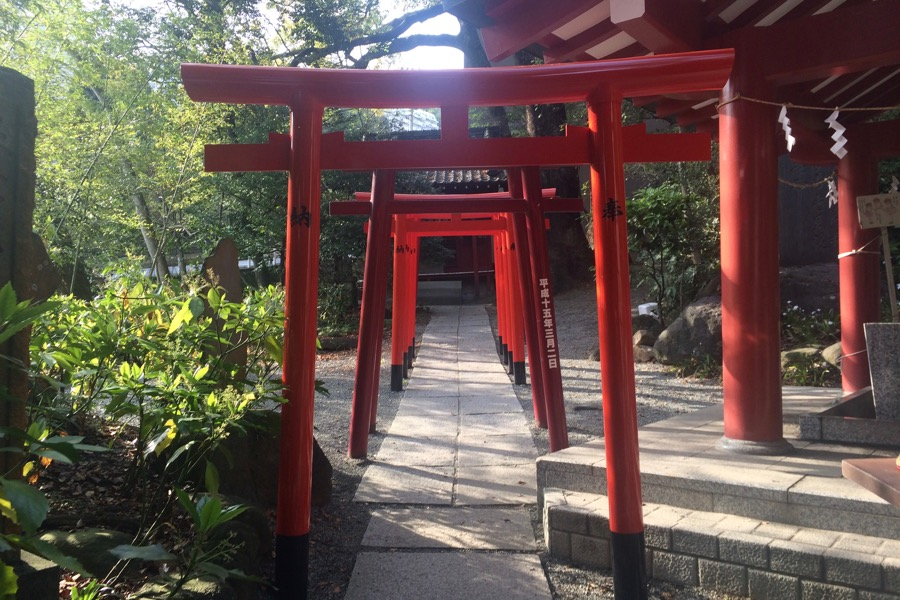
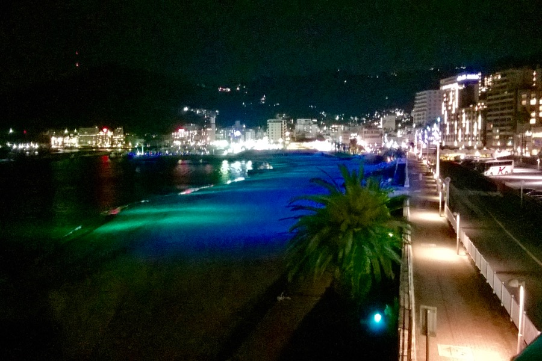

In the seaside resort town of Atami, weʼve been pampered. We took an onsen bath three times within 16 hours. Before going into the shared bath, you have to ritually and thorougly clean yourself (along with other patrons). Nudity is the norm in the onsen, and genders are separated. The water is hotter than at home - it is tons of fun.

Like [Conrad and Mr. Ringelhuth in The 35th of May](https://en.wikipedia.org/wiki/The_35th_of_May,_or_Conrad%27s_Ride_to_the_South_Seas), we have been enjoying bizarre dishes. For example:

- fermented soybeans (natto) with mustard
- green-tea pudding
- fresh tofu with grated ginger
- transparent eel-larvae (Eszter only realized now that it was eel)
- plenty of raw fish.

