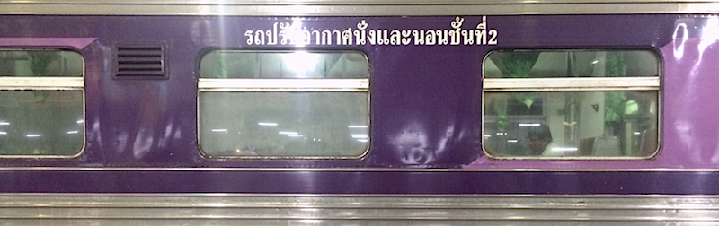

We've been to hot places, but this is almost unbearable. It is nearly impossible to survive in open air, so after having picked up our train ticket to Ko Samui, we sat in the first air-conditioned café we spotted, and spent the whole afternoon there. We had dinner in the train station's food court, for which we could only pay with vouchers that had to be obtained at a separate counter.

Stepping into the food court, we were attacked by dense chili-filled air, strong enough for military use. No surprise that our choices were an extremely and an even more spicy dish – both of which were exquisite.

Until our train departure, we enjoyed Thai X-factor on an oversized screen in the waiting room (which was more like a hangar).

We also made a curious discovery: we alternate between countries that drive on the left, and those that drive on the right. (China: right, Hong Kong: left, Vietnam: right, Japan: left, Taiwan: right, Thailand: left.)
