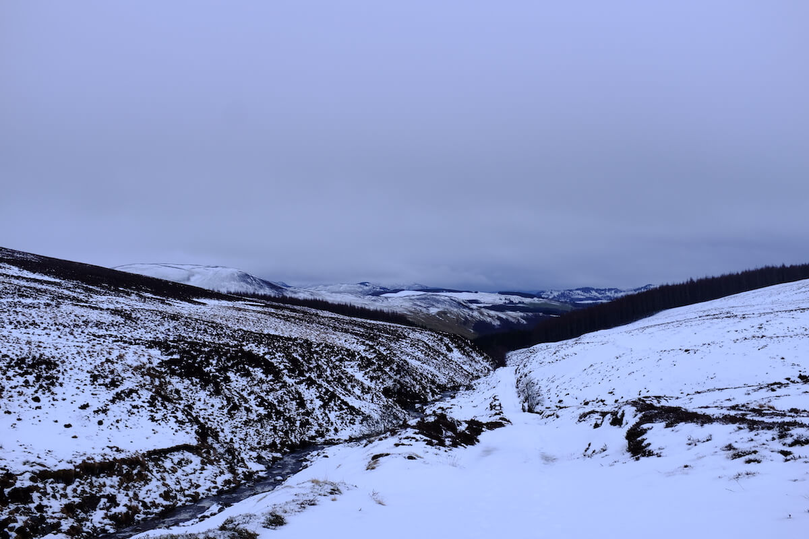
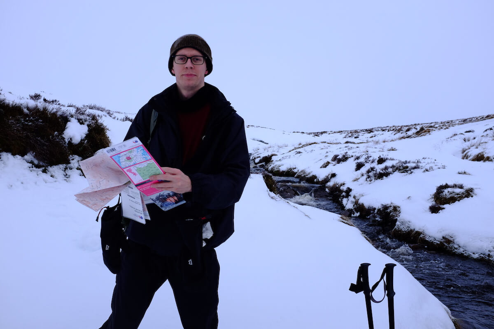
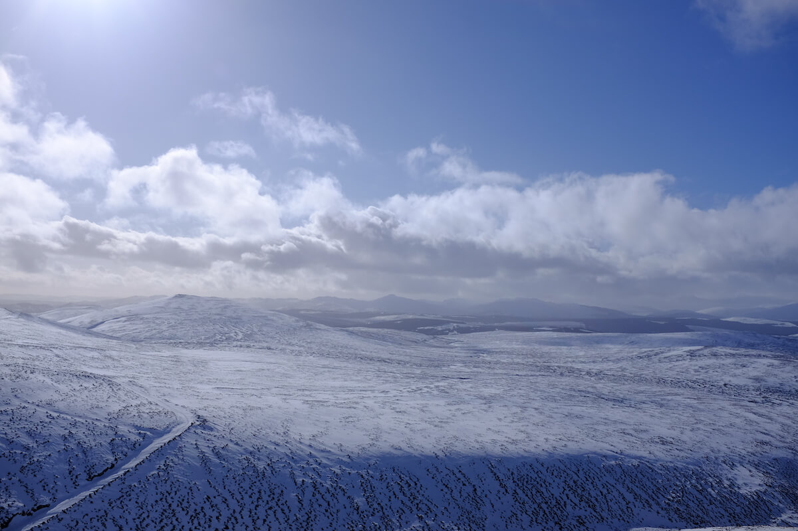
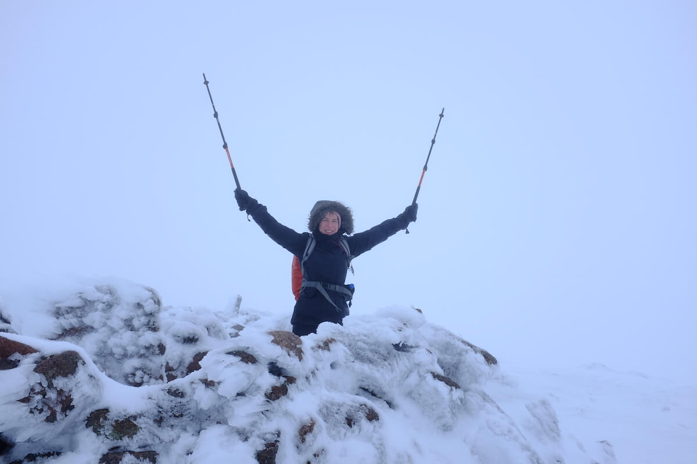
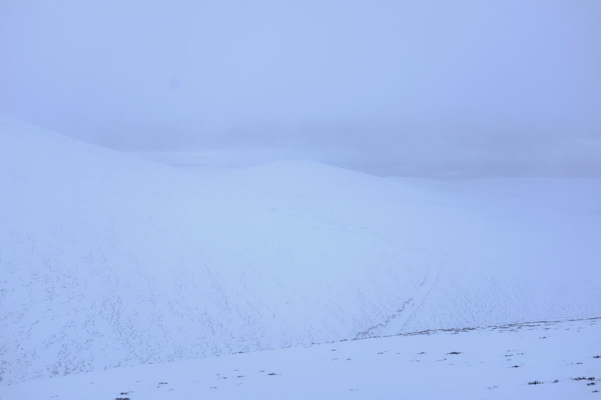

A storm named Dennis, total whiteout, hours of plodding in virgin snow all tried but couldn’t stop us from getting up there. It took us three attempts, but we’ve bagged Beinn Dearg in the end — and in winter conditions.

## Take one: Where are yous heading?

It’s 4:45am, Saturday 22 February. “Where are yous heading?” — asks us the lady at Perth train station. “Blair Atholl”, we say, suspecting complications. “The train’s been [cancelled due to flooding](https://www.bbc.co.uk/news/uk-scotland-south-scotland-51502662). Try the 8am.” So we went back to base.

There was no 8am train, nor any other train later that day. All that excitement and preparation sometimes just goes to the bin due to bad weather, to not being in top condition, or any other mishap. It’s part of the package, and it’s best to learn to accept it.

## Take two: Hard terrain

5:45am, Saturday 29 February finds us in a much better place: Blair Atholl train station. Pitch dark, we are trotting through the grounds of Blair Castle, with only our head torches to light our way.

Soon, we’re out of the forest, and around 6:30 we no longer need the lamps. It’s muddy and slippery, we stabilise our steps with trekking poles. We are on the wrong side of a long fence, so we have to take a long detour, but eventually we find a spot where we can climb over. Mud turns into slush, slush turns into snow. Our path leads through a ford, but we decide not to risk it, and stay on this side of the brook — the footpath will cross back again in a kilometre or so.

We have to be careful now: there are some streams that are entirely covered by snow, that we don’t want to step into. We wish we were even  *more* careful, but one learns well the hard way… one boot soaked. Good thing we packed dry socks!

The landscape is vast and white, and it has been very calm so far, but a strong, cold wind starts as we ascend Beinn Dearg’s slopes. By this time, our boots are soaked, and we’re exhausted from marching miles through virgin snow, and the lack of a proper breakfast.

It’s beautiful, and intimidating. Among Scotland’s munros, Beinn Dearg looks like an approachable one, yet we humans are small and the Cairngorms are all-powerful. We stay humble and turn back, hoping to get further next time.

We meet other walkers at a near bothy, have a short rest, and walk back to Blair Atholl on the lighter route. The cozy, warm pub in Atholl Arms Hotel serves soup of the day and has a couple beers on tap (although we’d recommend to stay away from the sour locally brewed varieties). We make note to try the catch of the day next time. Or maybe the pheasant burger – but that may feel cruel to the pheasant we passed on our way back.

It starts snowing, and we’re glad not to be on the munro top right now.

## Take three: Practice pays off

> Whiteout noun\
> a surface weather condition in a snow-covered area (such as a polar region) in which no object casts a shadow, the horizon cannot be seen, and only dark objects are discernible

Learning from our previous experience, we knew we needed a proper breakfast, gaiters, and a less demanding route to the foot of Beinn Dearg, so we don’t run out of time (and energy). It starts very well: although our train is delayed, by 9am we are having breakfast at the [bothy](https://www.mountainbothies.org.uk/bothies/eastern-highlands/allt-scheicheachan/), with dry feet, feeling in full force.

We reach the bottom of the munro in about 45 minutes, and begin the climb, following some cramponed footsteps that disappear after a while. We don’t have crampons, but it’s all right, the climb is not too steep, we have trekking poles, and the snow is very sticky (so sticky in fact that we can’t practice [ice axe self-arrest](https://www.youtube.com/watch?v=94QFImjdEAo)). Tailwind helps too, and the slope eases into an almost even terrain after half an hour or so.

There’s total whiteout, our only point of reference is our map and compass, and our knowledge that we need to bear 30 degrees from north. It feels like some kind of otherworldly dreamland, where all material manifestations cease to exist — it’s only us, in a milky nothingness.

Scattered rocks signal that the summit is near (and that we are still on Earth, still in this universe). Soon, we reach **Beinn Dearg (1008m)**, we drink our remaining hot coffee (extremely welcome in the ice cold wind), and start our descent.

On our way back, the wind is so strong and loud that any shouting is useless,the person behind has to use the emergency whistle whenever we have something to say (need to rest or are unsure of our bearing). We descend fairly fast and the view clears up somewhat, to show a beautiful, endless white landscape.

Another short rest in the bothy, and then, back to a different kind of bothy: the Bothy Bar in [Atholl Arms](https://www.athollarmshotel.co.uk/). The pub is warm and cozy, catch of the day (grilled salmon) and pheasant burger are both delicious. We resolve to come back — both to this corner of the Cairngorms, and to this corner of the Bothy Bar.
