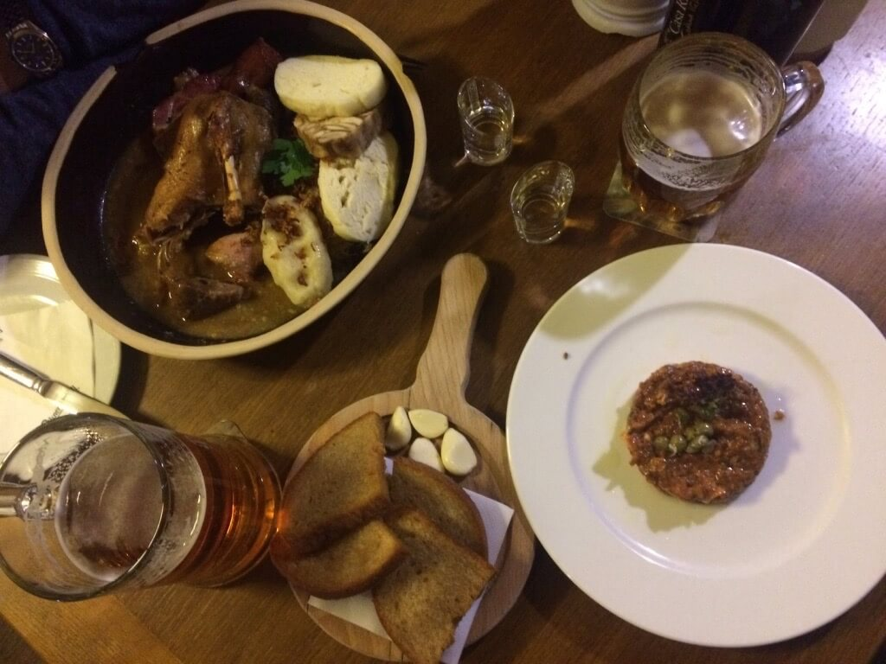

We spent Christmas in Hrabalʼs birthplace, Brno (Czech Republic). We feasted on four different kinds of meat: chicken, beef (raw and fried), duck, pork.

We tried seven types of beer: the local Starobrno, dark Kozel, Pegas pilsner, Pegas dark, the massive Pegas Christmas Special, Pegas weissbier, and Pilsner Urquell. Pegas itself is a small brewery and restaurant in Brno, so we couldn't have gone more local.

We’ve also had four types of spirits: Becherovka, Borovicka, and — thanks to the preferences of a run-down pub’s regulars — Captain Morgan, and an even more horrible, bad, bad copy of Captain Morgan.

We have played a huge xylophone in the Castle (dating from the middle ages), and had great walks there. (The park was covered in snow!) We climbed up to see the gothic-like (um.. not an expert) cathedral, which looked quite scary in the fog.

On the 25th, we went for a swim to the local pool, together with all the Czechs who wanted to shake off the extra weight gained during Christmas. 
