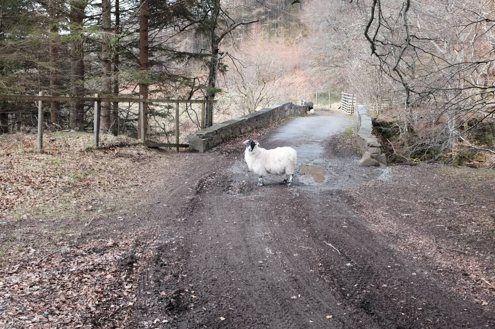
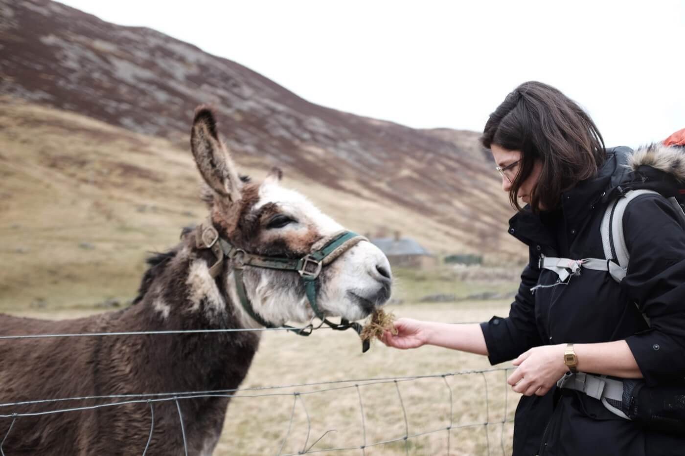
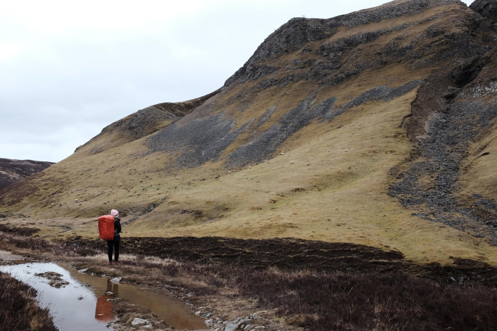
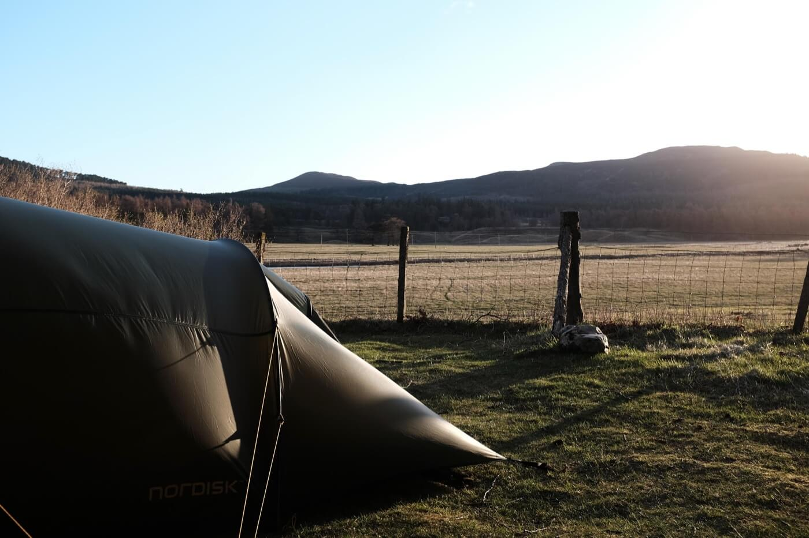

We spent two and a half days hiking in the Scottish [wilderness](https://wilderness-society.org/european-wilderness-society-supports-mapping-project-to-reveal-europes-wilderness/).

We had exquisite company: sheep, a friendly donkey, a white hare (we did follow it!), a pheasant, and wild geese.

Our first night was so windy we could barely sleep in the noise. We were really at the mercy of the elements, including the almost-freezing temperatures of the second night. Our down sleeping bags, plus cups of hot coffee and soup kept us warm.

