<video src="/video/vn_mot.mp4" poster="/video/vn_mot.png"  autoplay loop>
</video>

Motorbiking is a fun way to explore Vietnam, so that's what we are doing.

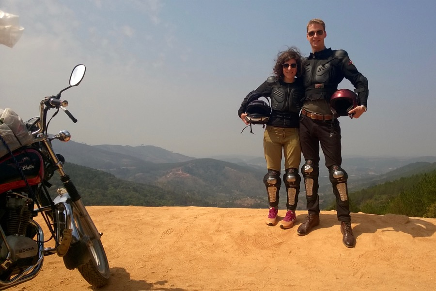

So far, we have seen:
- Coffee, cocoa, tea, rubber tree and cashew plantations
- Brick and chopstick manufactures
- Silk factory with silkworms
- An elephant having breakfast in the jungle
- Rice paper and rice noodle factories
- A floating village
- Beautiful, endless forests.

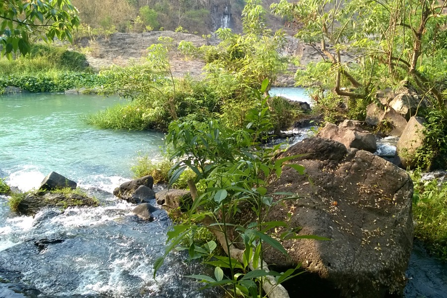
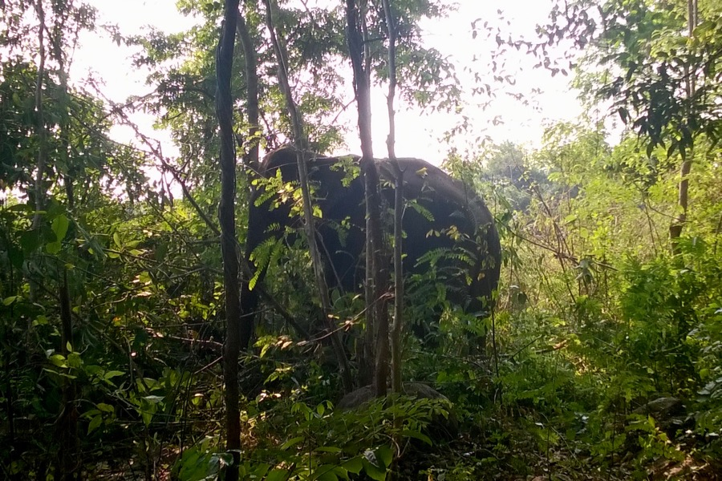
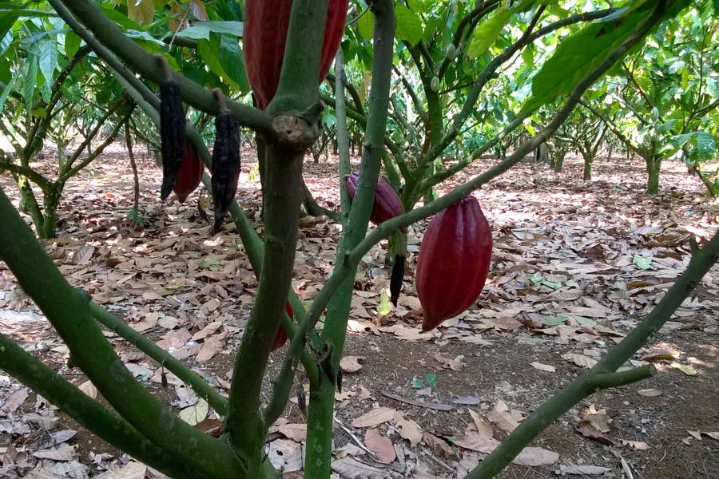
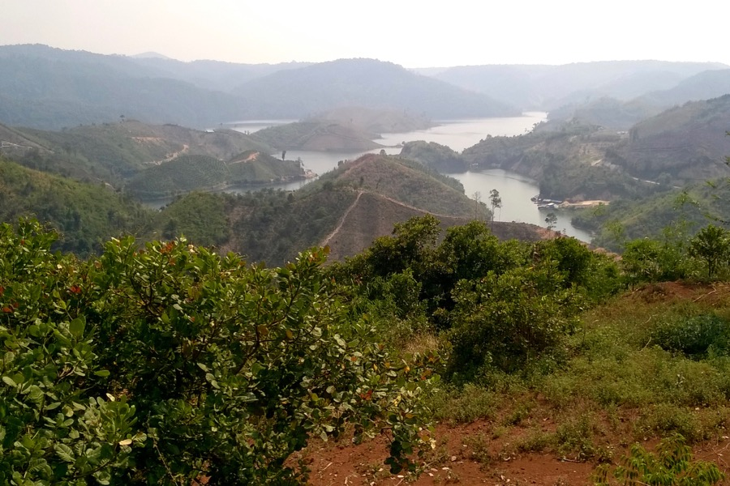
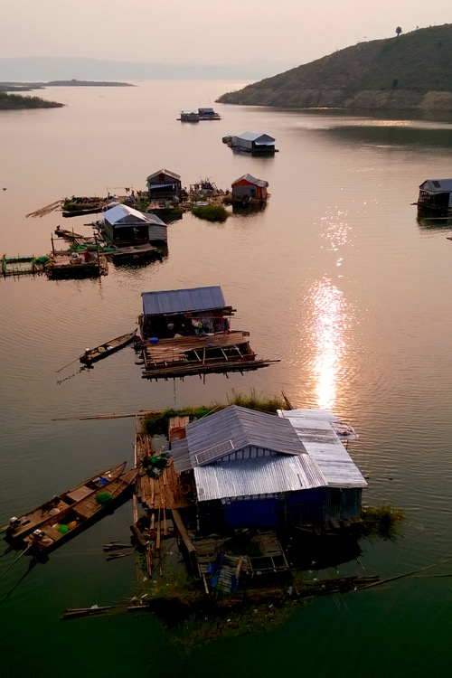
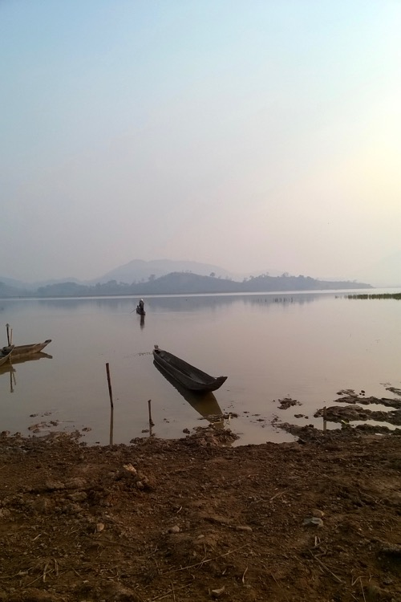

When not riding, we did some other cool things, like:
- Swim near a waterfall
- Ride an elephant
- Drink weasel coffee (kopi luwak)
- Eat silkworm larvae
- Sleep in a traditional longhouse (minimalism to the extreme).

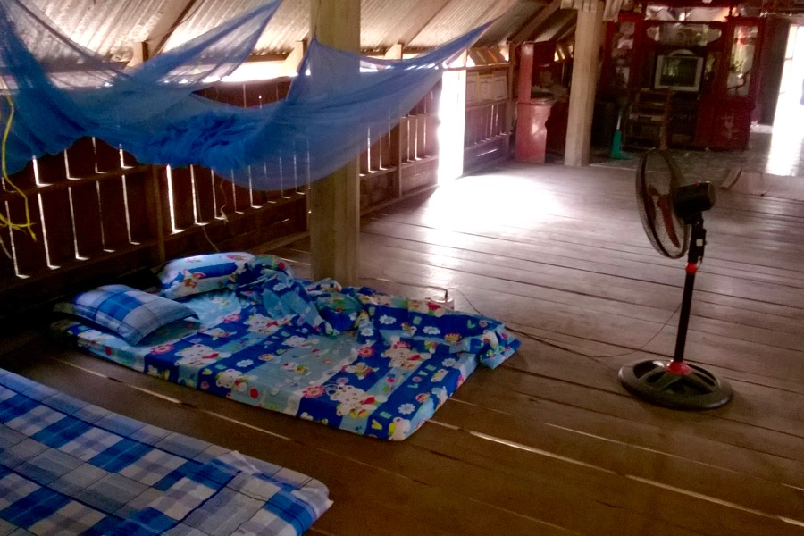

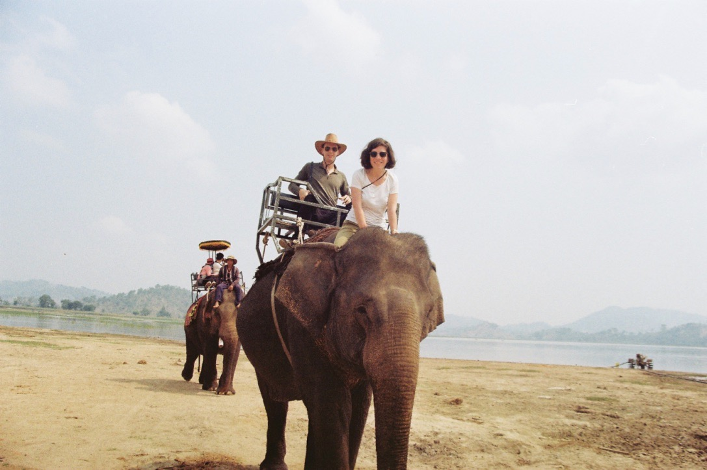
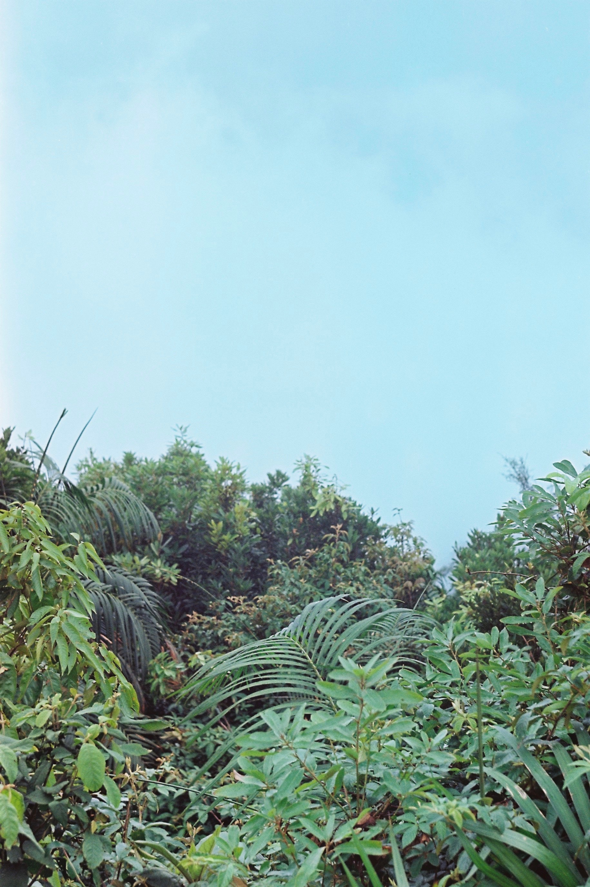

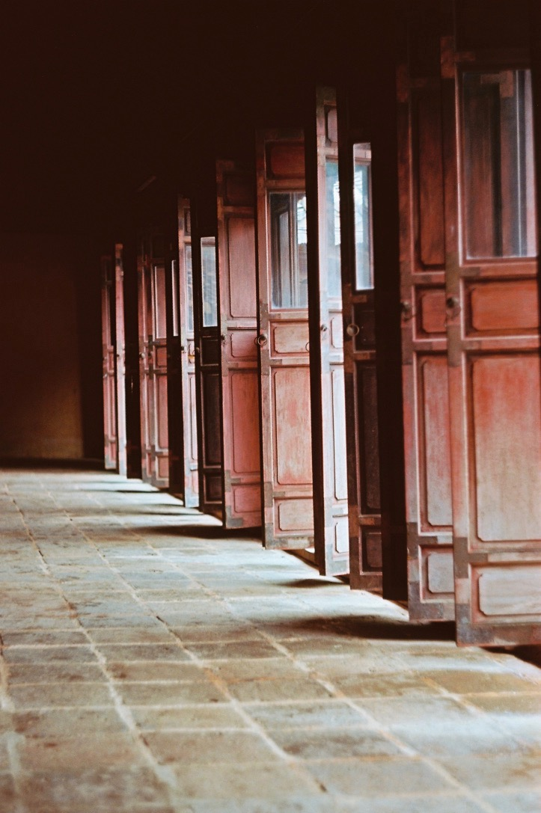
