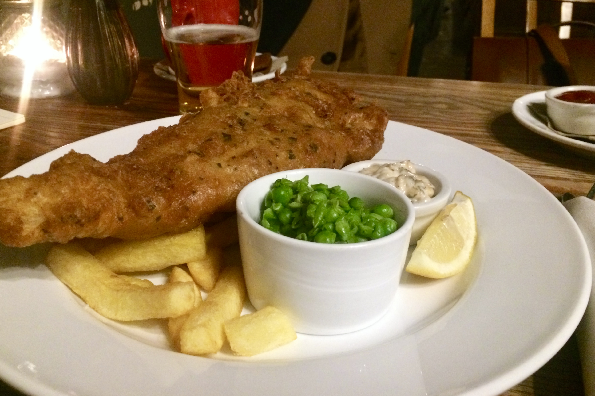

Despite the popular notion, the food is great in London.

We have sampled among others:

- butter chicken with waffles and maple syrup
- Full English Brexit breakfast (sausages, beans, bacon, egg)
- soft Portugese grilled chicken
- spicy indian and thai curry
- wafer-thin Italian pizza
- sushi and those triangle rice-sandwhiches (onigiri)
- Vietnamese soups and noodles
- chicken-chorizo burrito with avocado and cheddar
- fish and chips at the Red Lion pub in our ‘hood
- tons of cheese (they even have our favourite French blue chese here, St Agur)
- delicious cupcakes

Plus Samu saw **battered sausage** in a chippy — what a concept! Not sure if it’s disgusting or the best idea ever.

And there is a store specifically for Spanish ham. Spanish ham shop.

Later on, we might write about beers as well, but for that we have to do some research first.

