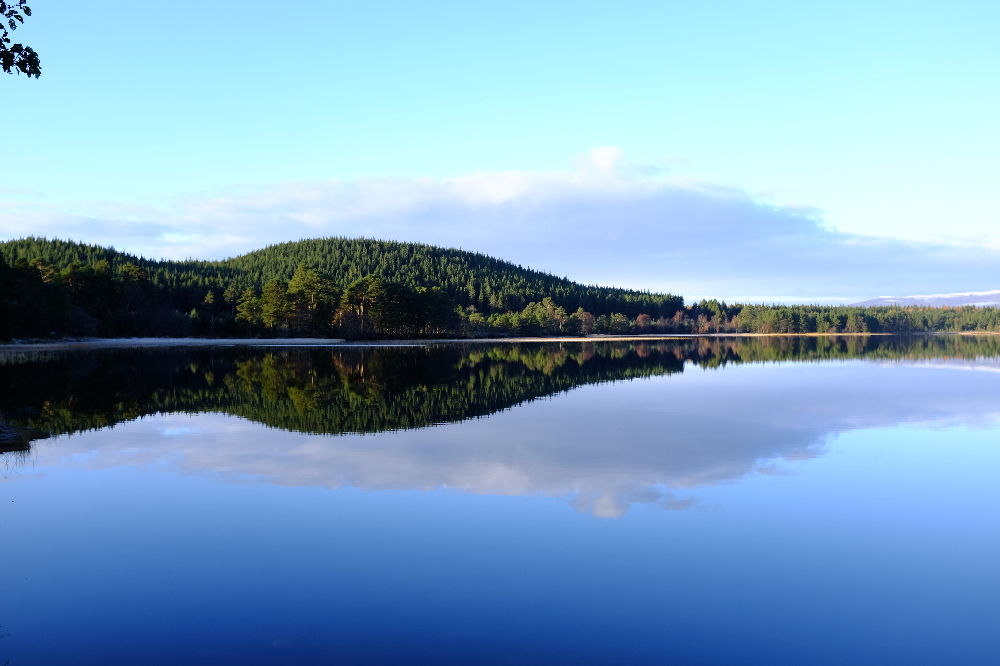
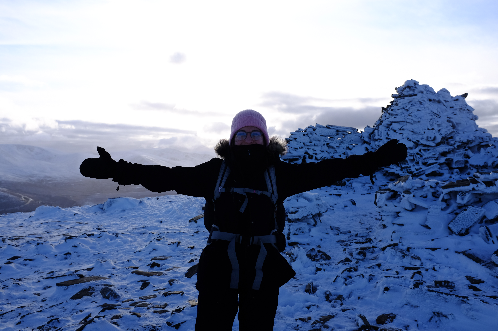
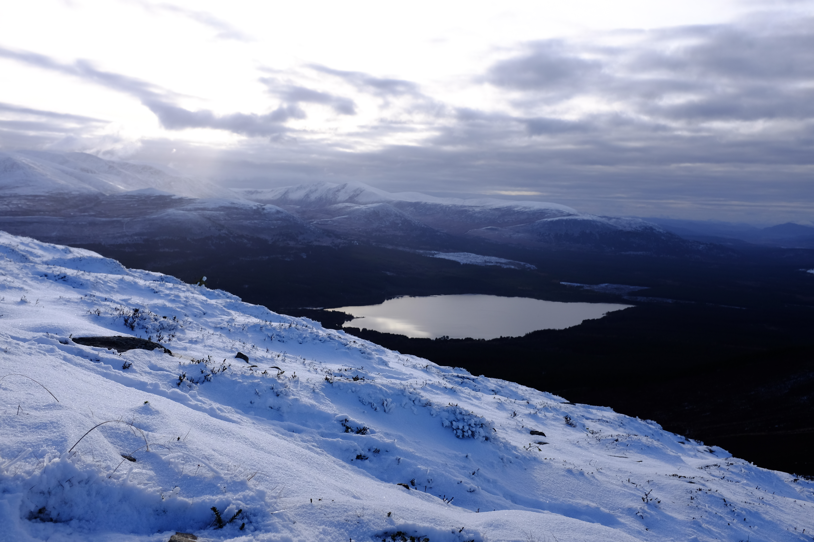
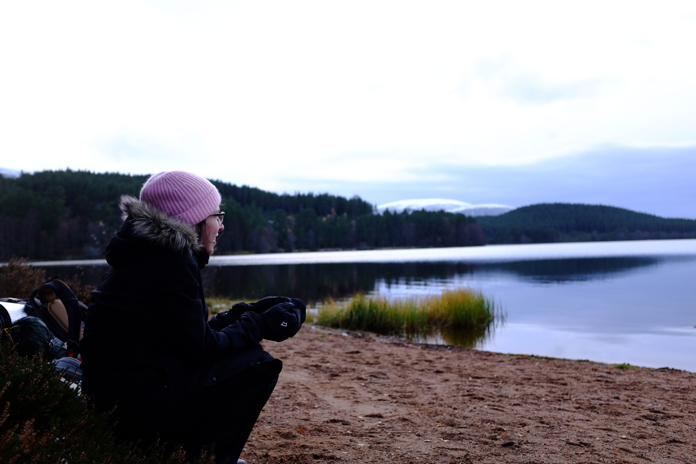
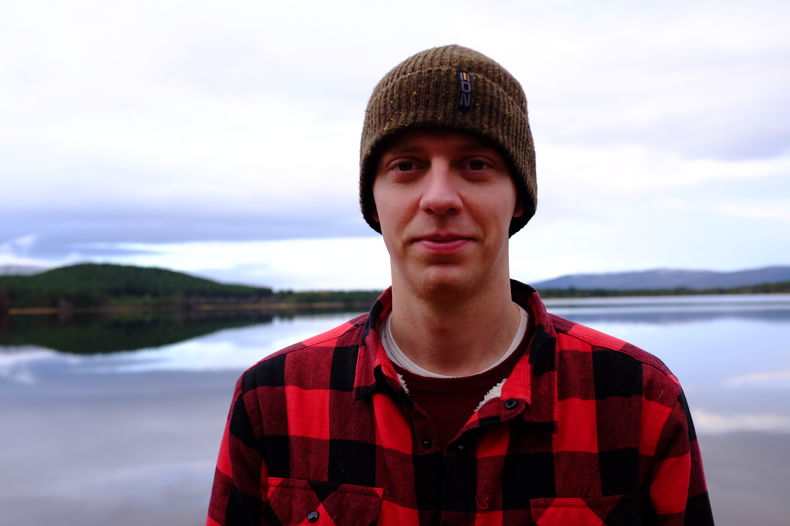

<video src="/video/loch_morlich.mp4" poster="/video/loch_morlich.png" autoplay loop>
</video>

Clear skies ahead as we head out of Aviemore. The forecast had been downpour, but not a single drop so far. In front of us, the mighty Lairig Ghru mountain pass. We are nowhere near experienced enough to take that on in mid-November — instead, we’ll turn left and aim for Loch Morlich.

Loch Morlich and the surrounding Glenmore Forest are our home for the weekend. We couldn’t be luckier with the weather. Temperatures around 0℃ at night, with a couple of snow or drizzle flakes quietly knocking on our tent.

Night falls very early in November: by 5:30pm it’s pitch dark, and too cold to just chill outside. It will be an early night.

Our second day leads us through a lovely valley, past a small lake called An Lochan Uaine, where we stop for lunch and say hi to the passing walkers and their dogs (plenty of them, all enjoying the lovely weather).

The aim for today is Meall a’ Bhuachaille (810m). Not quite a [munro](https://en.wikipedia.org/wiki/Munro), but offers lovely views.

Our second night at the loch is just as fine as the first — down sleeping bags keeping us toasty. It doesn’t matter all that much whether you have one winter bag or two summer bags. So, for the two of us, our all-season sleeping system consists of two summer bags and one winter.

One thing we’ve noticed though: wet sand is way colder than dry leaves. Maybe it’s time for a winter mattress, too?

That’s an upgrade for next time. But the upgrades we did for this trip were well worth it: torches to head torches, proper waterproof mitts, and small enough snacks and water bottles to always have some in a coat pocket nearby. And [Kendal Mint Cake](https://www.mintcake.co.uk/).

Some more pics can be found here: https://photos.app.goo.gl/97SdabNuqX34XEGs9
