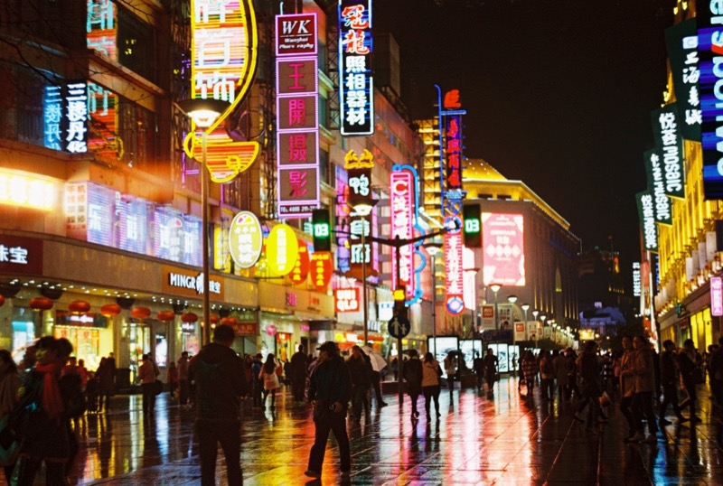
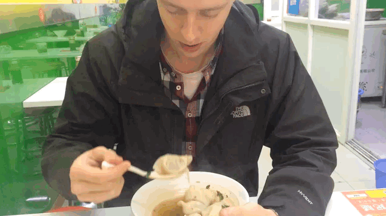

We’re back to report ourselves now that we had a good rest. Today we woke up both at 3am and 3pm (hello jetlag, we love you), we registered at the police station, and we ate some sugar-coated strawberries on a stick.

Shanghai is slightly warmer than Budapest. People talk to us in Chinese, sometimes we understand a bit, but it will get better. We are quite a sight here, a group of four asked if they can take a photo with us, all four of them separately.

Our accomodation is very well located (relatively quiet but with good public transport, supermarket, post office, bank within minutes…), our bed is comfortable, the toilet seat is heated (we are not kidding). It's interesting to see how similar apartments and people can be, in two distant points of the world. 

Looking around in the flat, we found many objects we have ourselves at home too. Sure, globalisation must have its negative effects, but it is a good feeling to find the same glass, kettle, hand weights and box of instant film in Shanghai’s Meihua Road, than 8500 km-s from here, at home, in Budapest.

Food is good and portions are huge, Eszter can be full up without doing much damage to her serving. 

