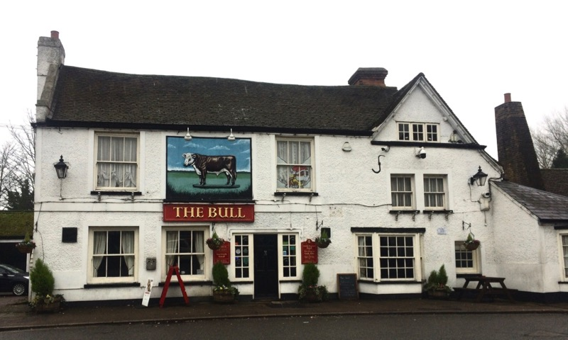
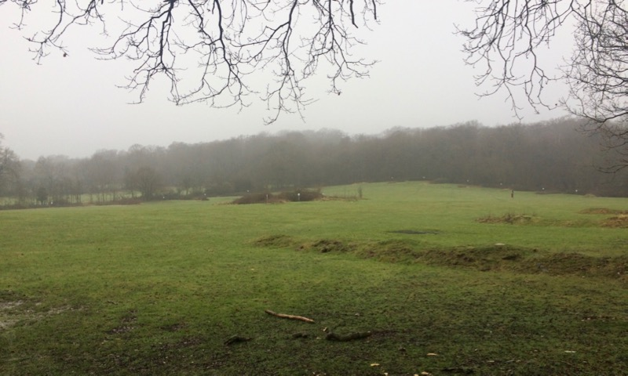

Despite the not so great weather, we went hiking in the Epping Forest last Sunday. They say there are a lot of deer living there but we haven’t met them. However, we saw rabbits and squirrels, and there was a proper snowfall too!

We were cold, we were jumping over streams, we got lost in a camping, and we were stomping in mud. We are looking forward to going back there!

This building is a pub in Theydon Bois: 

And we went through these cute gates:  

And we were walking in the wet grass on these nice fields:  

