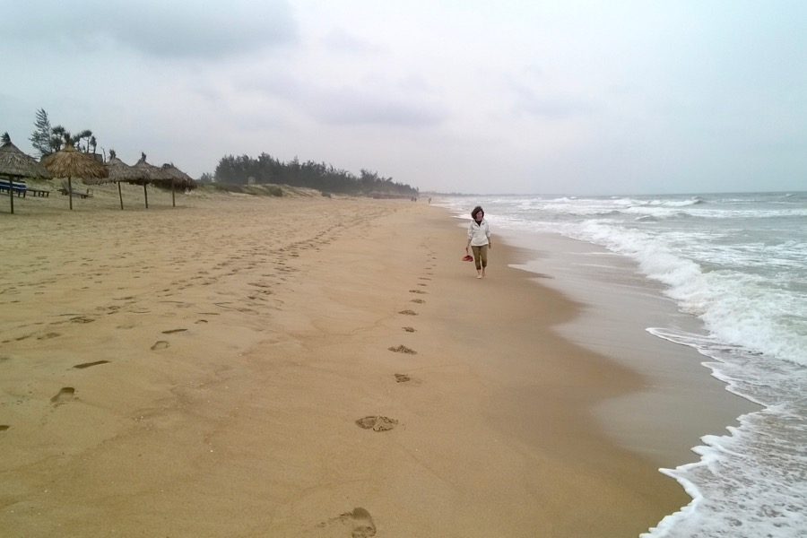
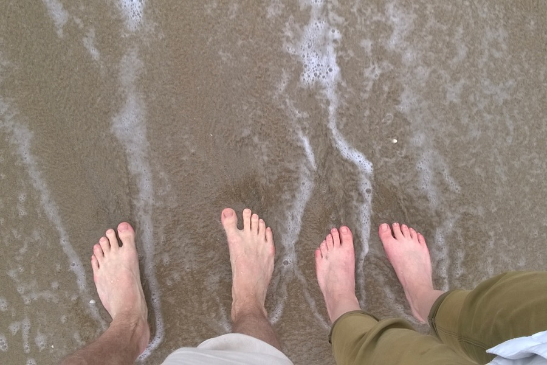

Hoi An is a small town in central Vietnam, close to the sea. It has a nice old-quarter and residents live mostly off tourism. Clothing is a big business as well: people from the West come here to get cheap, tailor-made, quality suits. We are still more interested in food and adventures around town. 

We have eaten things like:
- Chicken and avocado sandwich
- Shrimp "lángos"
- Sandwhich with peanut butter, chicken, soy- and chili sauce
- Duck breast soup with fried blood and hot sauce

We rented bicycles and rode to the sea in the afternoon. The beach was not that crowded. We saw some water buffalos along the road as well.

Bargaining is a useful skill in Hoi An. Most prices are quite high here because of heavy tourism, but we usually manage to get a 30-40% discount, especially because it’s low season now.

