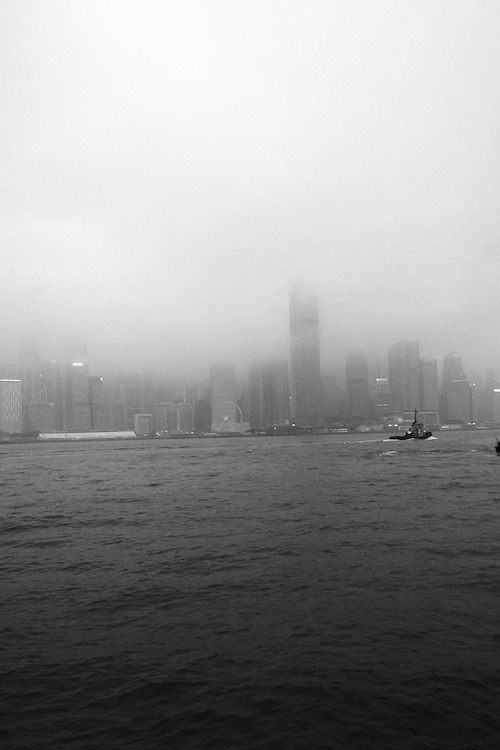
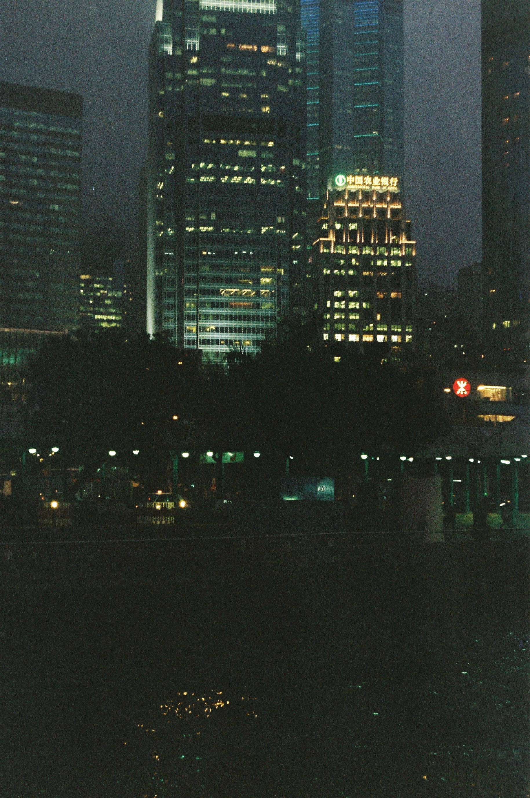
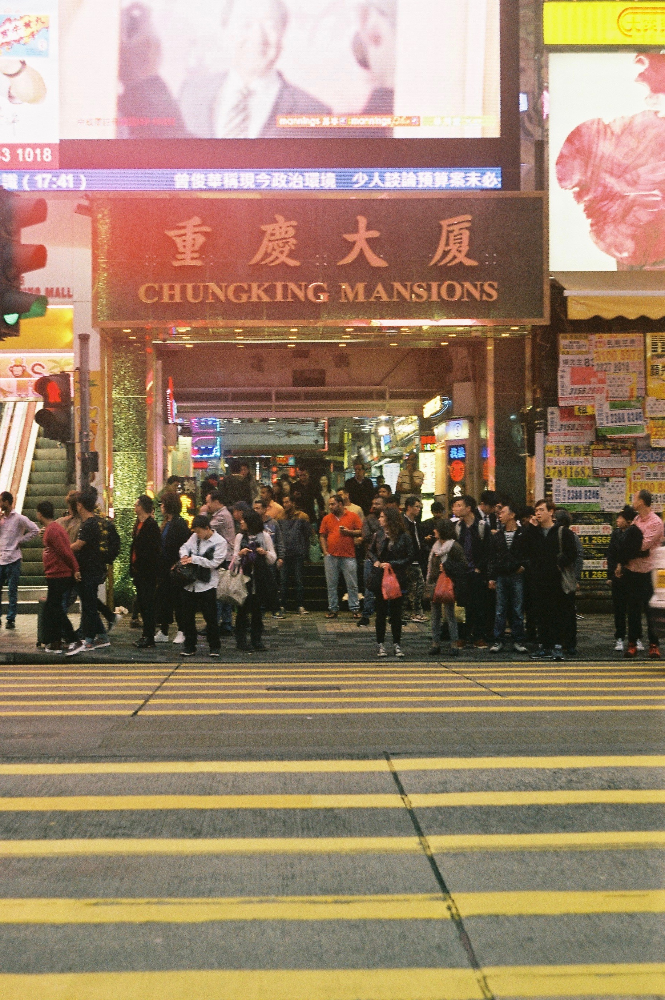
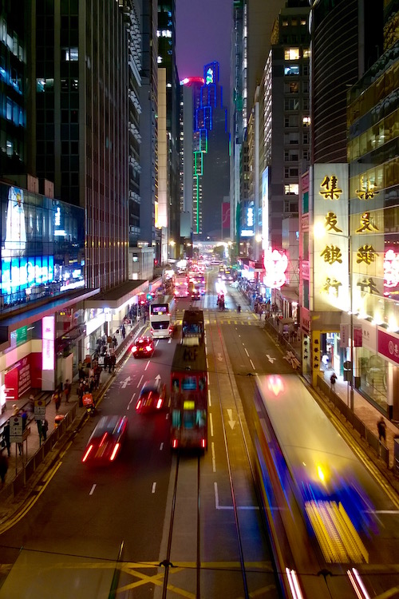
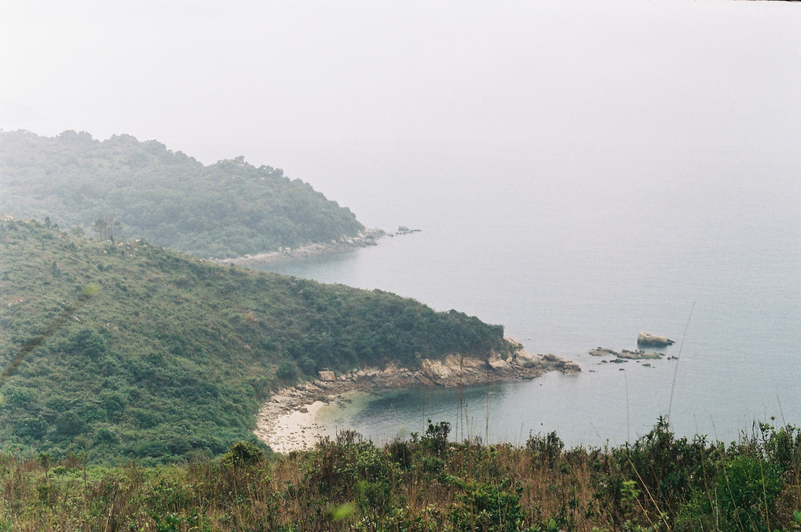

<video src="/video/hk.mp4" poster="/video/hk.png" autoplay loop>
</video>

The air is hot and humid in Hong Kong, our first dessert was dark-chocolate coated Kit Kat, and you don’t even have to really eavesdrop to hear at least eight different languages during a half-hour period (Cantonese, Mandarin Chinese, English, Arabic, Hindi, Spanish, German, French).

Our “apartment” is at least 7 square meters large and is situated in an area featured in multiple Wong Kar Wai movies — [Chungking Mansions](https://en.wikipedia.org/wiki/Chungking_Mansions) from [Chungking Express](https://en.wikipedia.org/wiki/Chungking_Express) is just in front of us. That place is quite peculiar, not comparable to anything (except maybe the underground of Nyugati tér, but more welcoming), with the smell of curry, kebab and pizza in the air and large african males sitting on weak plastic chairs drinking heavy liquors and smoking in the arcades.

This afternoon we went to Lamma island, a small, lush green island that serves as a weekend getaway for many Hong Kong residents. After our hike, we drank fresh coconut juice and ate the coconut meat as well, after smashing it on a rock, quite like monkeys.

