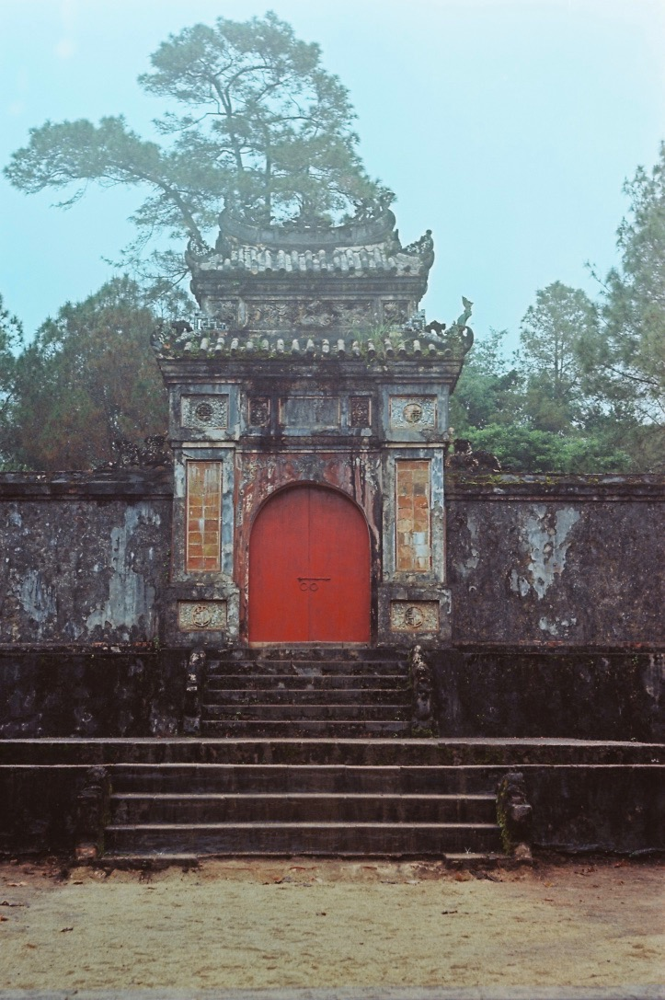
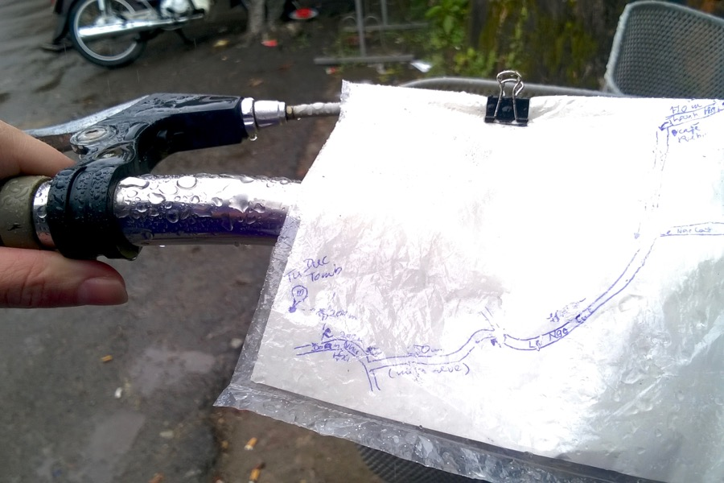

Our bike tour was exciting. In about twenty minutes we left the city and we were surrounded by old cemeteries and lush green vegetation.

We headed to the tomb of emperor Tu Duc, but the ride there was even more fun that the supposed attraction. Riding in the rain felt like freedom.

