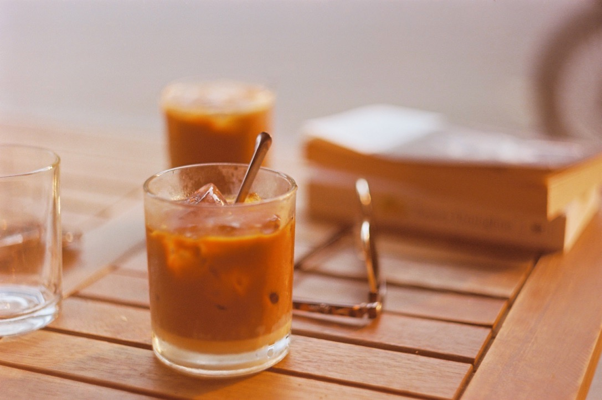
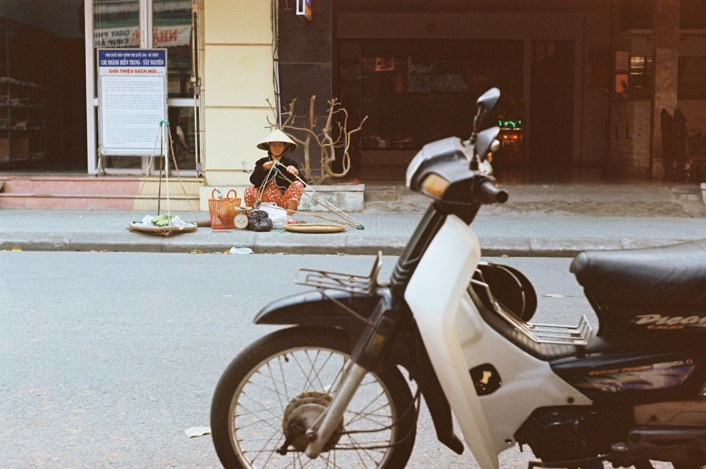
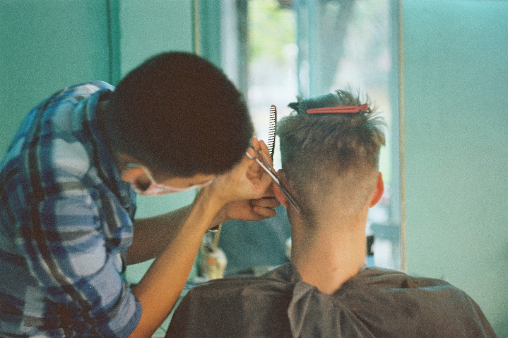

In Vietnam, Saigon black coffee is served on ice with condensed milk. This is our favourite beverage here. Today we enjoyed ours in a small riverside café, while watching the river traffic from tiny plastic chairs.

As for ground traffic, it consists almost entirely of scooters. There is only one method to cross this swarm: slowly but continuously, without hesitation. It seems quite scary for a while, but it works like a charm. 

Streetfood is fantastic, and beer is exquisite. Today we bumped into a market, where we had a delicious soup made of vegetables we don’t really know. 

Samu also got a haircut. 

We will rise early tomorrow to explore the surroundings by bicycle. It’s going to rain, but in this heat, it doesn't really matter.
