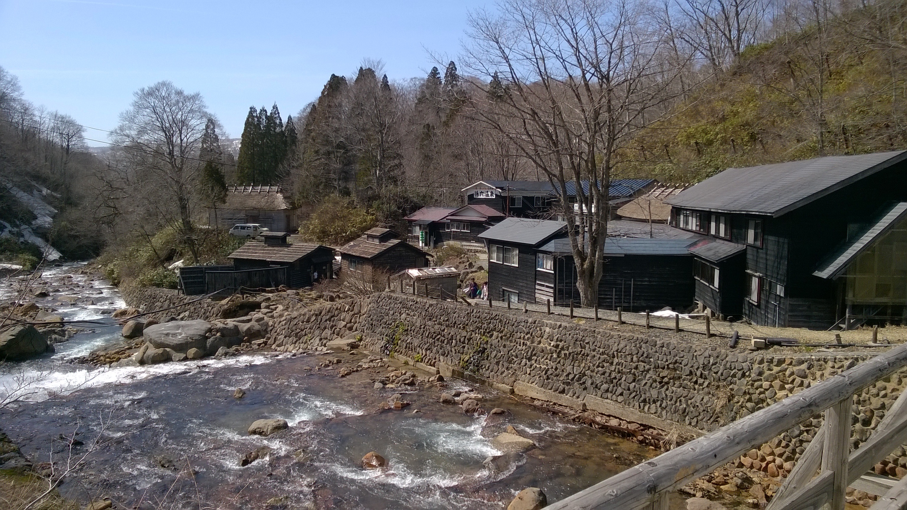
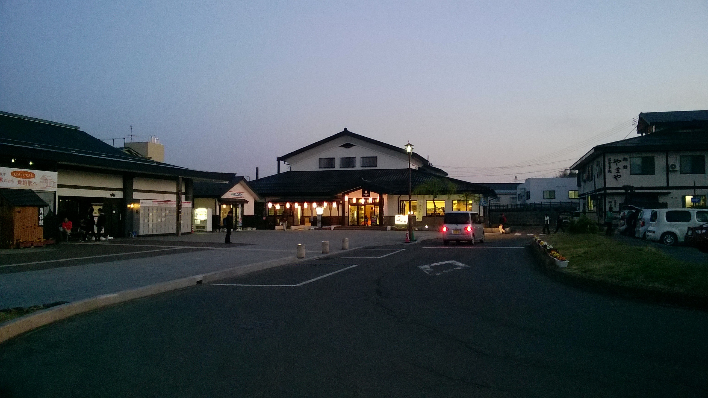
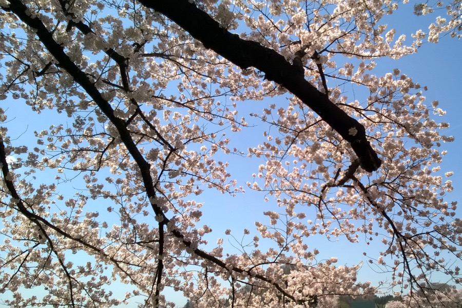
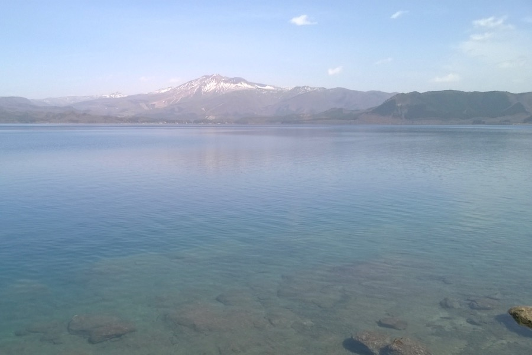
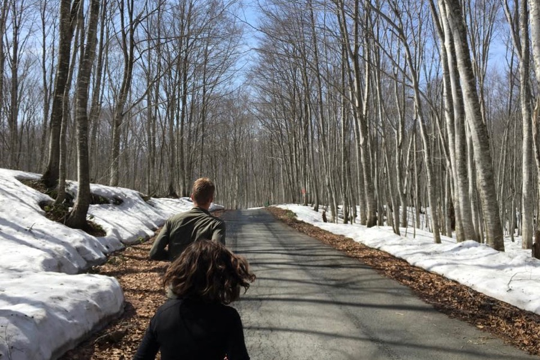
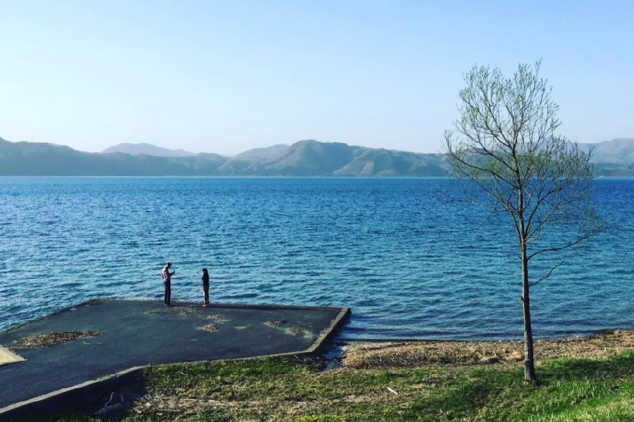

Our last Japanese trip was also excellent, thanks to Yoshi for the once-in-a-lifetime experience!

We saw cherry blossoms, ran among snow-covered mountains, bathed in a natural hot spring, and enjoyed the beauty of Japan's deepest lake (423 m).

All this, though 590 km from Tokyo, could be done in a day-trip — thanks to the amazing 296 km/h speed of the Shinkansen. 

