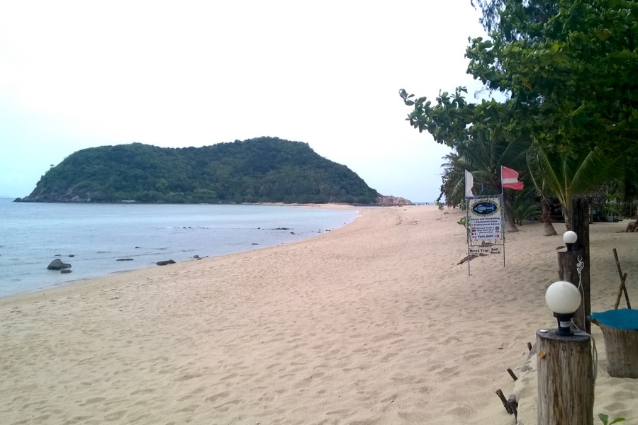
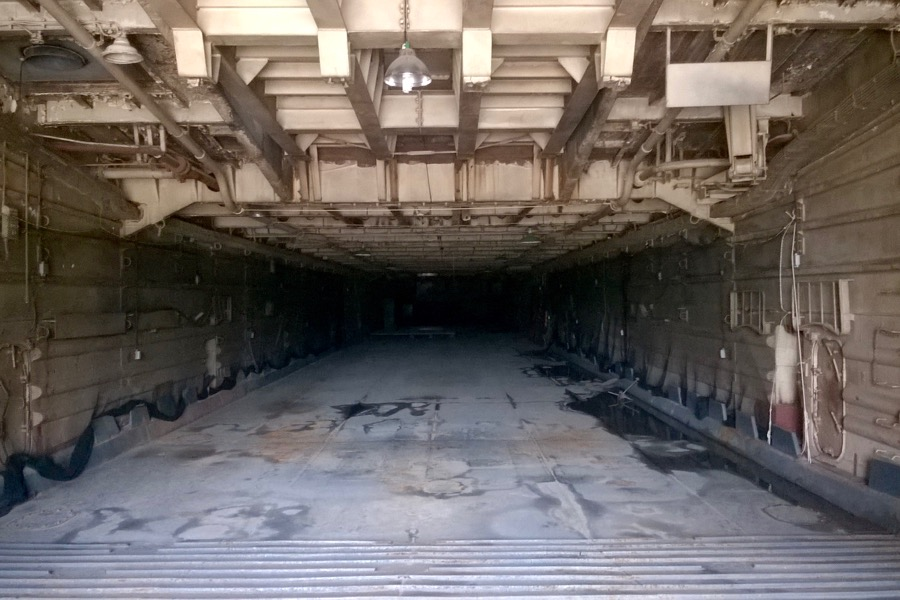

Yesterday we got up early and took a day-trip to nearby Ko Phangan. It's a more relaxed island with most of its area covered by a national park. The north-western tip of the island is connected to another tiny island by a narrow strech of sand. We spent the day there. 

 

We glanced into the stomach of an old warship, this can also be seen on the pictures. It was given to Thailand by the US in 1957.

On the way back, we had just enough cash for a tasty streetfood comprised mainly of chicken on a stick. 
