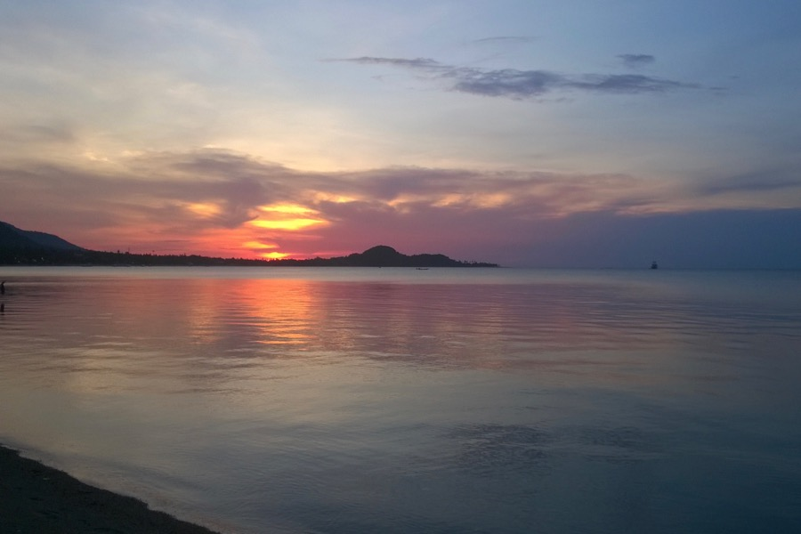

We have arrived to Ko Samui. It is the major tourist destination in the area, visiting crowds have noticeably taken their toll on the environment. We will have our base here for a few weeks, but we will go to other islands as well (Ko Tao, Ko Taen, Ko Phangan). Seawater is very warm, around 31.7 degrees Celsius, which is a bit disappointing in this heat. 

We watch the sunset every day. Pastel colors appear around 18.15 (flax flower, lavender, periwinkle), while more intense, deeper ones (vermilion, burgundy, carmine) take their place around 18.35.

Please send us emails as we miss you. 
