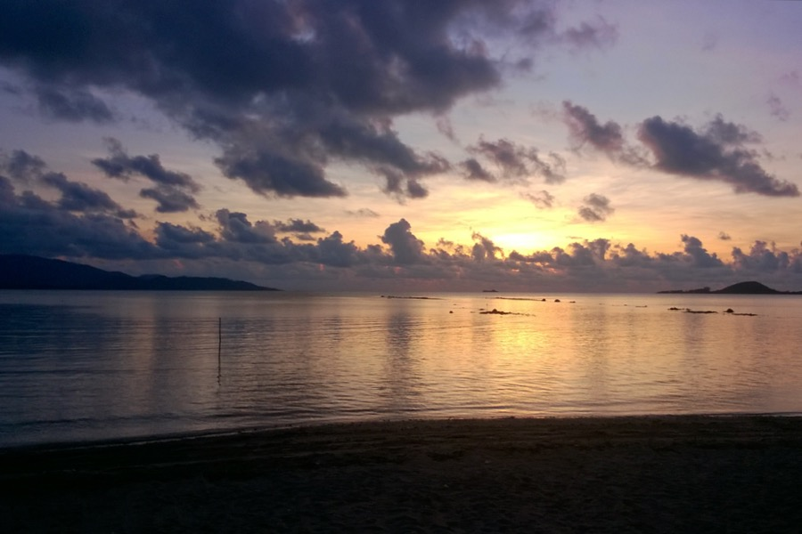

We spent the weekend on an almost desert island. According to Wikipedia, Ko Tan has about 20-30 permanent residents. We have spotted this little island on the map, and we could not find much information about accomodation or transport. In the end, we managed to ask a tour operator to leave us on the island, and to pick us up the following day. So that's what happened. Once there, we rented a beachfront bungalow.

We met some huge buffalos on the island; luckily, they were more afraid than we were. The sound of the jungle was like in a documentary, with exotic birds chirping around us constantly. We also saw some big lizards.

**The rabbits that appeared bouncing on the beach at night were a strange sight.** The moonlight was so strong that it seemed like a spotlight, with high contrast shadows of the palm trees in the sand.

The following morning we hiked to the less crowded side of the island, where we had a coke. There is no running water, no electricity except for a few hours from a generator, but, for sure, there is coke. 

In the afternoon we were picked up by our boat and we continued our snorkeling tour. We saw bluespotted stingray, colorful corals and even more colorful fish. When we got home, we were exhausted and starving.

