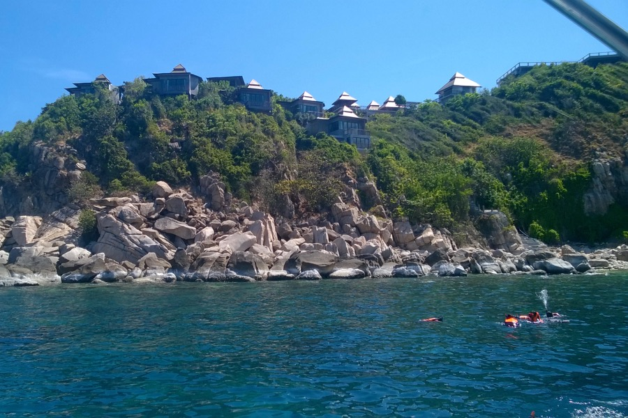

Today we left Ko Samui for the first time: we spent the day snorkeling around Ko Tao. We shared the coral reef with plenty of colourful fish. As for sun protection, we went for the safest option: long sleeves. In his fancy blue shirt, no wonder that Samu was the most elegant in the whole South China Sea today. 

Ko Tao is about 70 km from Ko Samui. Faithful to its name, our “speed boat” took little more than an hour to get there. On our way back, we even saw some dolphins jumping out of the water. 

Ps... the fish werenʼt skipping classes — they were swimming in _school._

