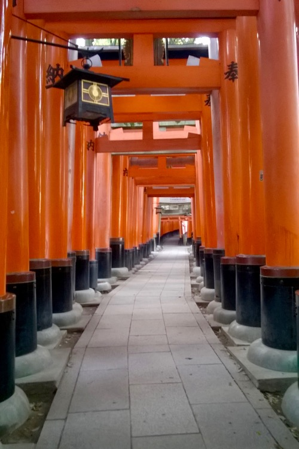

We took a Shinkansen on Monday morning, and headed to Kyoto. The “Hikari” bullet-train has an average speed of 226 km/h including stops, with an estimated 276 km/h travel speed.

Our accomodation was located in Fushima, in the Southern part of Kyoto. It could be reached by subway and train as well. Given that our Japan Rail Pass is valid for the railway, we used the latter. We crossed shopping streets spotted with all kinds of neat little stores (groceries, liquor stores, ceramics, stationaries, and so on). Our building was on the bank of small river, in front of Teradaya Inn (which has some historical significance).

Our room was on the fourth floor, in the end of the corridor, to the right. We had our own bathroom and even a tiny kitchen with a sink, a kettle, a kitchentop and a small table. The room had a big window looking to the river and the houses and trees on the riverbank. The top of our bed looked like a tatami mat. 

There was a beautiful park (with huge cedar and cypress trees) close to the building, with a long flight of steps made of stone - we used to run here in the morning. As the railway could be reached on foot, the location was great for day-trips as well: we went to Nara and Inari on Tuesday.

After climbing hill Inari (packed with tourists), we descended into a peaceful suburb of Kyoto. Beautiful, well-kept houses: this is a rich neighborhood, but with nothing fancy or flamboyant.

The following morning we took a second ascent to Inari, this time it was practically deserted due to the wee hours. Some old japanese gentlemen were praying and climbing to the top to give their respects to the God of Foxes. 

Feeding in Kyoto was exquisite. On our first day we found a curry restaurant, with indian music playing from the stereo and a gentle, soft-spoken waiter who served us with great care, like it was only us who mattered in the world. We ate a good soup, fresh salad, naan and chicken tikka with several kinds of curry (mutton, shrimp, keema, dal...). We drank cold lassi to contrast the spicy food. We ate sitting on the floor, on pillows, legs crossed. It was so good we came back here once more during our stay.

In the evenings we usually ate sushi, sashimi, ramen that we bought in Family Mart. We drank local craft beer (Grand Kirin is our favorite), matcha latte or Nescafé.

During one of our exploratory evening walks we had the impression that everything here is like a decor in a movie shot: streets are calm and clean, quiet and tidy. It reminded us of “The Busy World of Richard Scarry”: everything is taken care of and people have their duty in the city.

We walked by a bar, which we took some time to recognize as such. At last, the sign that said 日本酒, or “Japanese liquor”, confirmend it was a pub. We started thinking about having a beer there, when we rememered a notorious story read on the internet about bouncers in bars in Japan, where sometimes they would stop foreigners from entering with a short phrase: Sorry, Japanese only. Then we were relieved when a half-drunk regular of the bar, having seen our hesitation, shouted at us: _Welcome, welcome!_

We entered and asked for two beers. We were given strange tall chairs by a humble, quiet gentleman who emerged from behind our drunk friend. The patrons seated behind us asked for some food, so the barman started frying small sausages. We chatted for a while before we headed home.