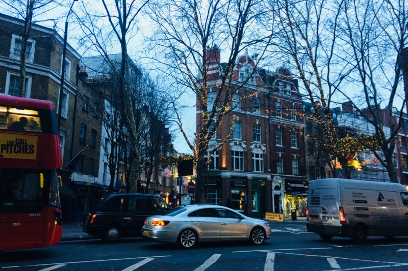

We have a strange feeling these days — like we happened to travel to a parallel universe which is _slightly_, almost unnoticeably, different from ours. Every item is a bit better quality than at home — a mug, a table, an office. People are a little bit friendlier, but not much. And at work, there is tea break instead of coffee break.

This feeling is aggravated by cars which always appear in the direction you are not looking. And for some odd reason, folks treat us like serious adult beings — how foolish! And it certainly is weird to go to work in a foreign country.

Work will be a major challenge and it is diffucult to believe that we came here so soon. But as racing driver Mario Andretti said: _“If everything seems under control, you are not going fast enough”._

The Catch-22 right now is that to open a bank account, we need a permanent address, to have a permanent address we need to rent a flat, for that we need money, for the money we need a bank account…fortunately our employers are we helpful with all of this and it will be soon sorted out. 

### Linguistics section

Just like in the blog about Asia, we’ll share some fun facts about language from time to time.

__greasy spoon__ — is apparently a run-down brunch place which serves fried foods.  
__chippy__ — fish & chips place.

Another piece of trivia: [Anglish](http://anglish.wikia.com/wiki/Anglish_Wordbook) is an artificial purist language that aims to use only Germanic words (not Latin nor French) in its vocabulary.

And this is how London looked like in 1927: 

<iframe src="https://player.vimeo.com/video/66115782" width="640" height="480" frameborder="0" webkitallowfullscreen mozallowfullscreen allowfullscreen></iframe>

<a href="https://vimeo.com/66115782">&#039;London In 1927&#039;</a> from <a href="https://vimeo.com/user5545392">My Vimeo</a> on <a href="https://vimeo.com">Vimeo</a>.

