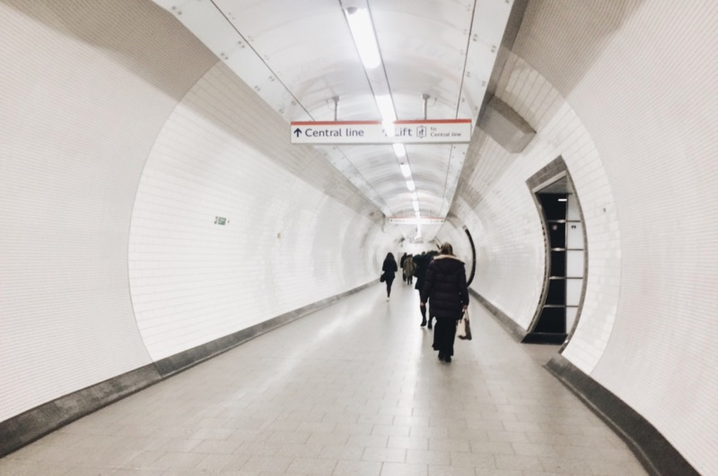
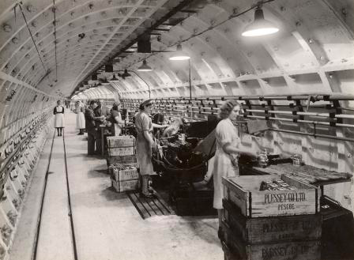

Commuting can be quite an experience in London, and we enjoy the daily thrill of rush hour of the Central Line and Overground for 2x30 minutes a day. You would think that the tube is much more reliable here that in Budapest, but that’s not necessarily the case. However, when here there is no tube, a 30 minute ride becomes a 1h30m bus + walk combo.

Of course, we would not expect perfect operation from a network that is more than a hundred years old. London’s, and the world’s first underground train opened in 1863. This is what the network looked like in 1908:

Some numbers:

- the full network is 402 km long (Budapest: 38,6 km)
- the longest journey without change is 54.9 km, which takes 1h 22min, according to Google Maps
- the longest single tunnel is 27.8 km
- only 45% of the whole network is really underground
- trains can reach speeds up to 96 km/h on the Metropolitan Line.

A bit of history: during WWII, an underground factory was operating on the new Eastern extension of the Central line, between Leytonstone (where we live now) and Newbury Park stations.

