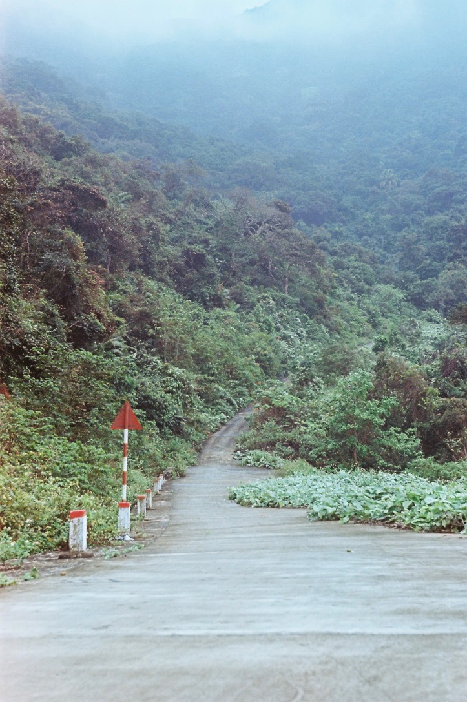
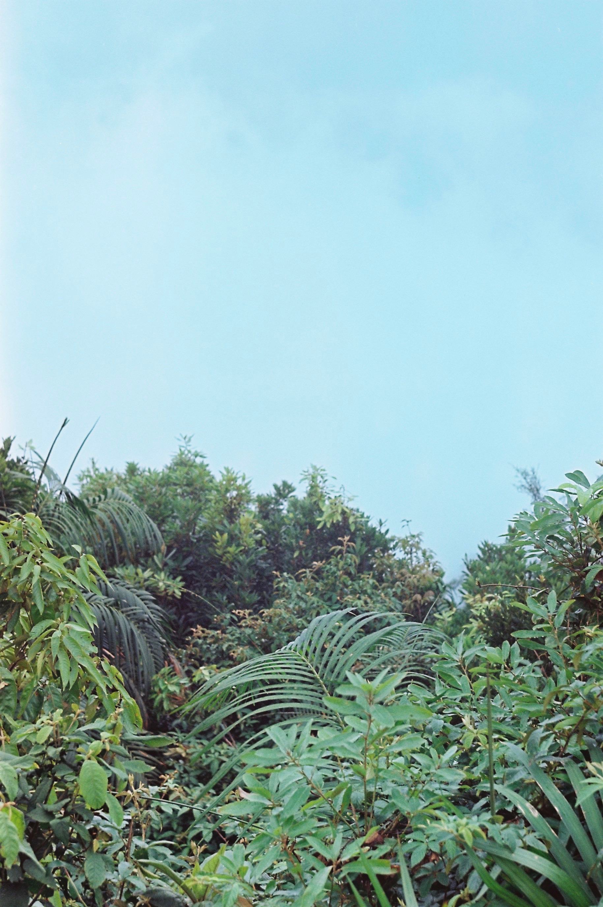
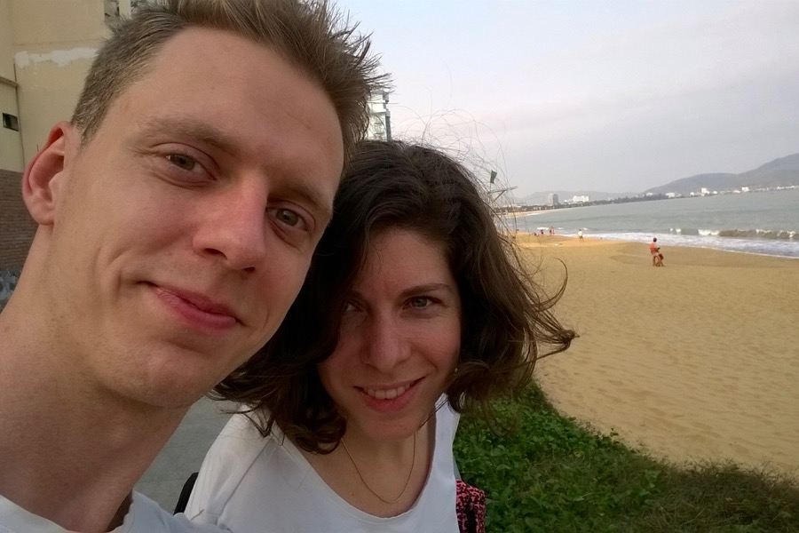
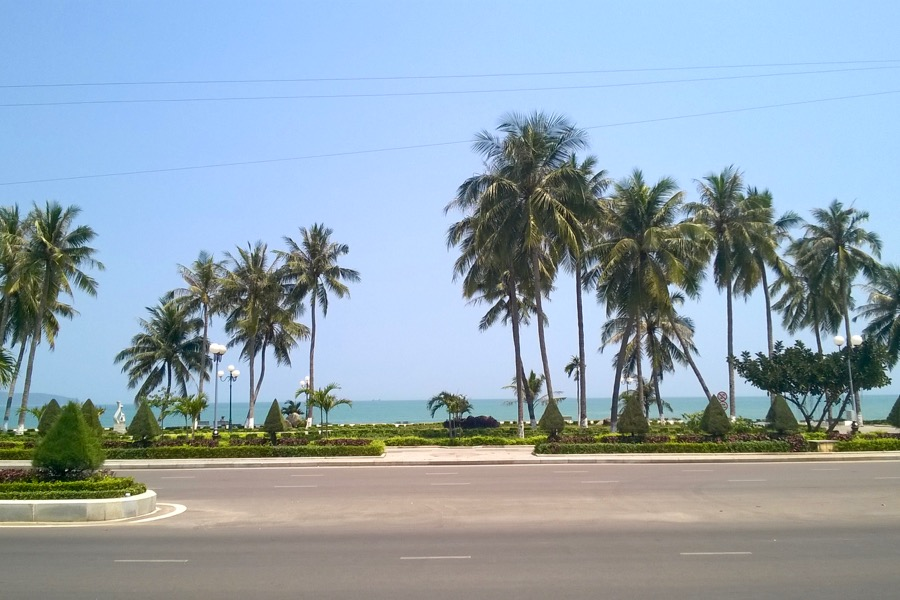

Ok, we have to confess: weʼve been on a full day motorbike trip. We got close up to rural Vietnam (flooded rice fields, water buffalos, farmers).

Sinuous roads took us up to the misty highlands, where we saw various kinds of monkeys and apes jumping from tree to tree. We enjoyed every single minute of it.

We discovered a small town on the coast, where there are no tourists, we can only communicate with signs and drawings, and our hotel doesnʼt even have an English _’hotel'_ sign. __Quy Nhon__ is refreshingly laid-back, our room overlooks the sea, and it feels good that nobody wants to sell us anything (except for a bottle of water maybe).

We rose with the sun — and locals: early in the morning is the only time cool enough for a light jog along the beach. By the time we finished, roadside stalls were ready to serve us a hearty soup for breakfast. After our morning siesta, we hired bicycles. Though it wasn’t our plan, we rode across a park-like leprosy sanatorium, which, oddly enough, is featured in our [guide book](http://www.lonelyplanet.com/vietnam/quy-nhon/sights/historic/quy-hoa-beach-leper-hospital).

We’re off to _crab_ something to eat. 
