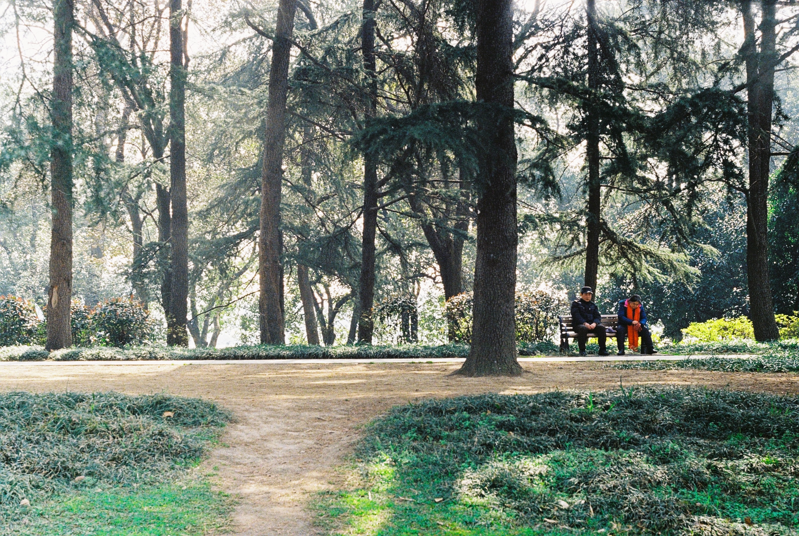
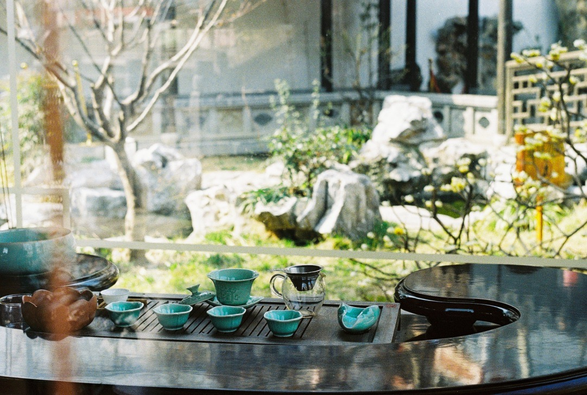
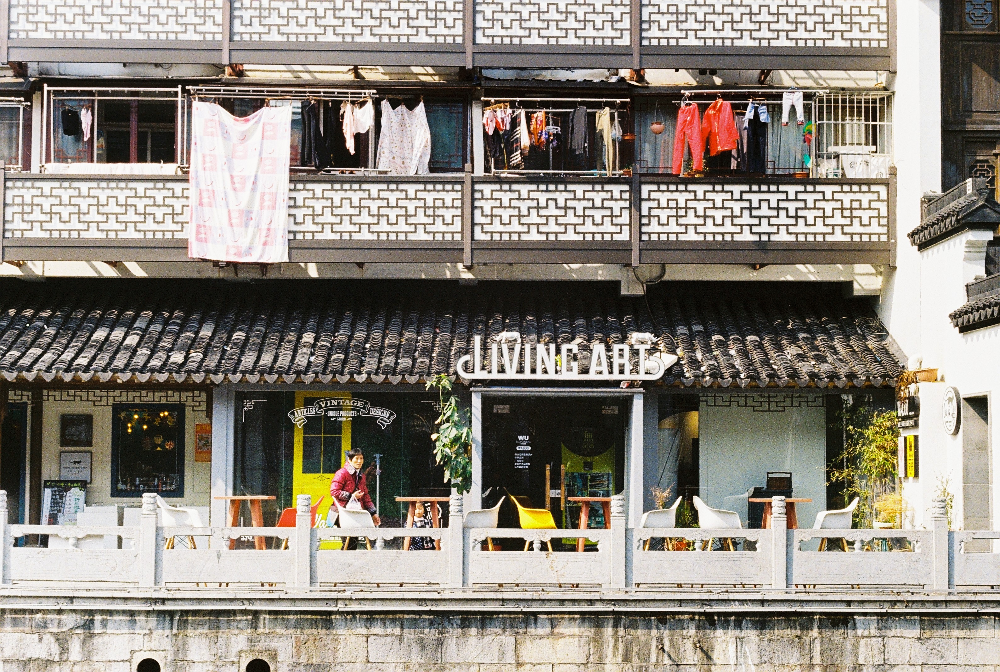
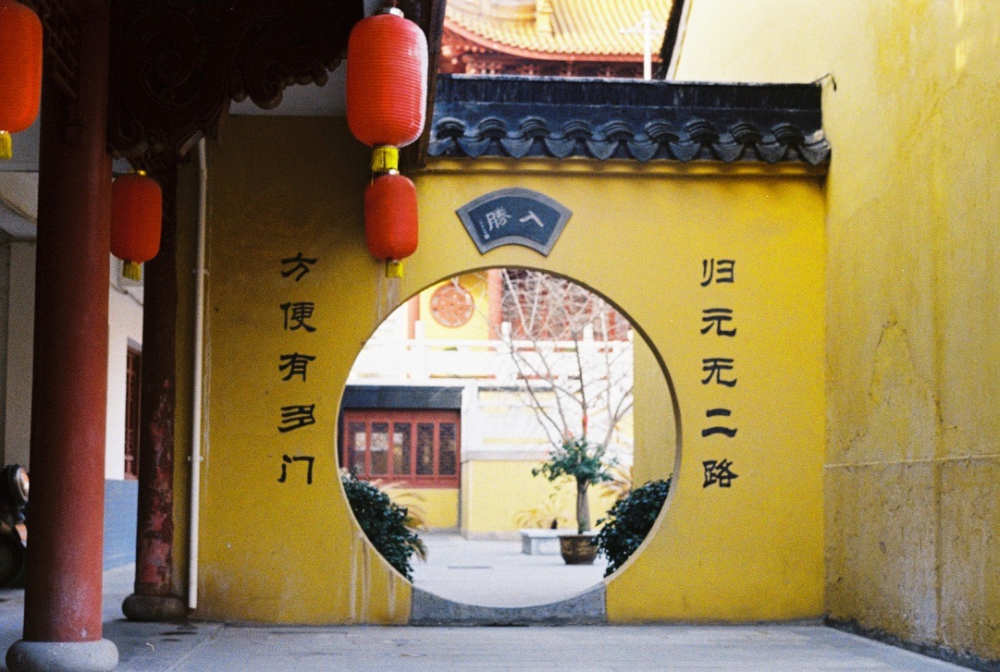
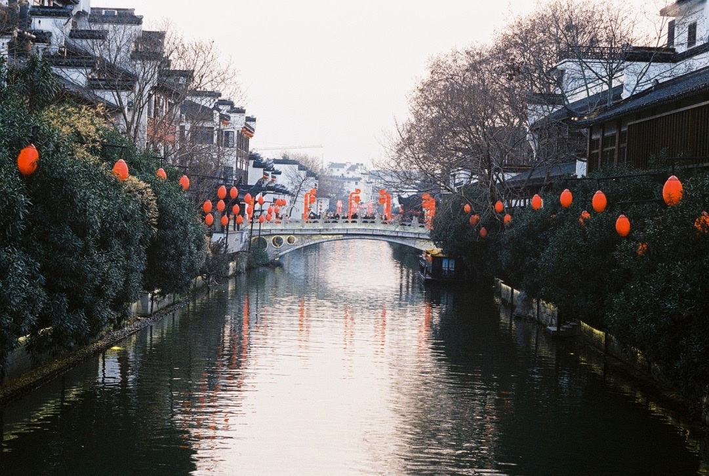

Our Nanjing trip was quite eventful. We started off early morning with a high-speed train (300 km/h) to the "southern capital". Some fun facts for language geeks: nan “南” = south, jing 京 = capital. Beijing is the northern capital, bei 北 meaning north. Tokyo, dongjing, 东京，is the "eastern capital". There is no western capital. 

Nanjing is a huge and lively city (with hordes of tourists and spitting locals), but it has some lovely, quiet places — tea gardens, parks with ladies practicing tai chi, and the Xuanwu lake's small islands with pagodas.

We had fried rice with beef for lunch at a small, dirty eatery in a tiny, dirty street, served by a smiling lady. We paid 10 yuan (430 Ft or 1.5 Euro) and it was more than enough for the two of us. Oh, and this included unlimited servings of soup. 

<video src="/video/cn_nj_food.mp4" poster="/video/cn_nj_food.png" autoplay loop>
</video>

Finding the Airbnb room we booked was quite challenging, as the host only communicated with us in Chinese (including directions to the flat and where to find the keys). Finally we found it, and having walked 31 312 steps, we had no trouble falling asleep.

