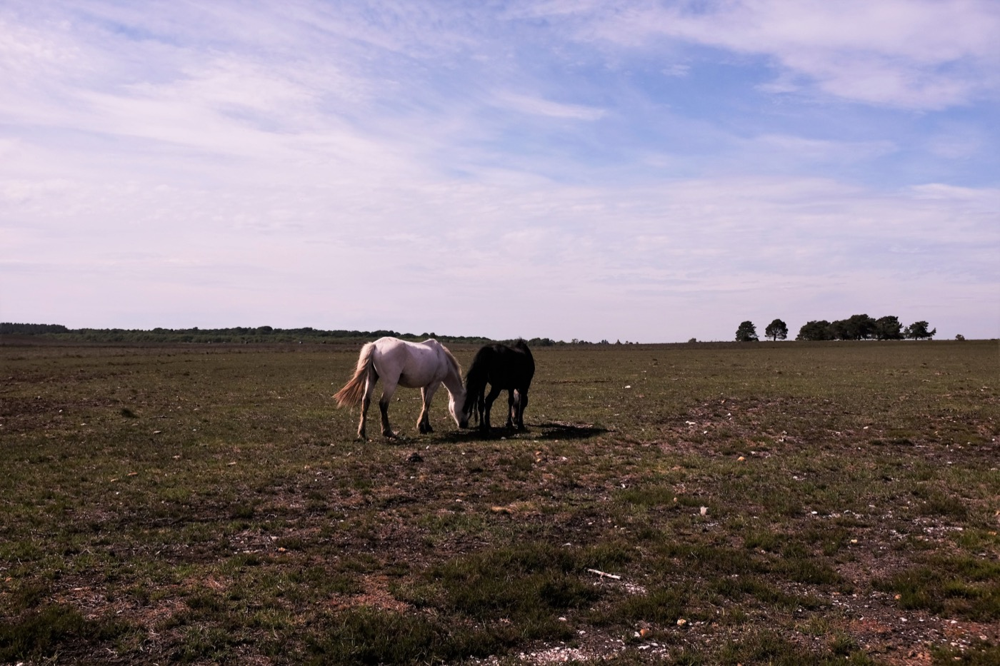
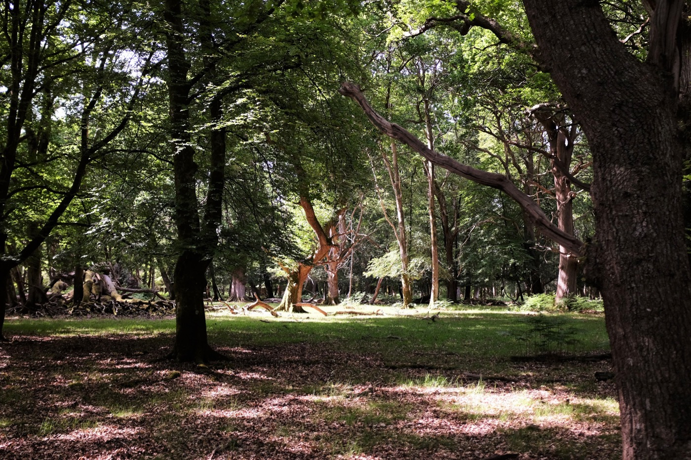

Well… itʼs not _really_ new. [William the Conqueror](https://www.britannica.com/biography/William-I-king-of-England)[^1] used to hunt here, so it must be roughly a thousand years old. We checked it out, and itʼs a lovely area, full of horses.

The horses are used to humans, but keep their distance. They are [New Forest ponies by breed](http://www.new-forest-national-park.com/new-forest-pony.html), and have their respective owners, but are free to roam most of the year.

The area has various camp sites, which was a good thing, given wild camping is illegal in England (as opposed to Scotland, where we [took advantage](/en/cairngorms).)

[^1]: Recommended read: [__A Short History of England__ by _Simon Jenkins_](https://www.theguardian.com/books/2011/sep/08/short-history-england-simon-jenkins-review)
