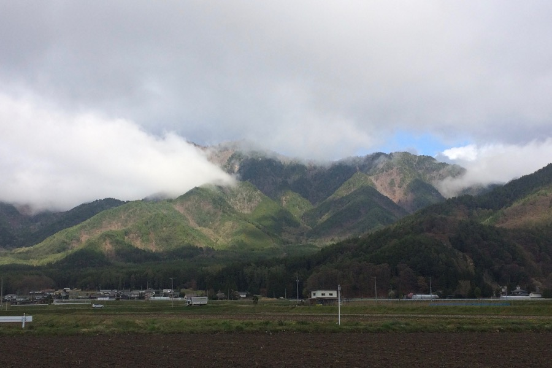
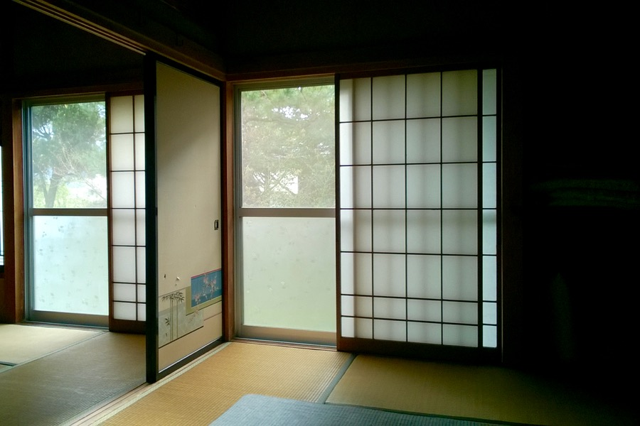

Our journey to Omachi took us through misty mountains in the Japanese Alps. Massive, dense forests and alpine streams dominated the view.

Although more than 70% of the land of Japan is mountainous, most of which is covered by forests, Japan imports 80% of its timber (mainly from China, Russia, Indonesia, Chile and from some other countries). The notorious Japanese timber industry thus contributes to heavy deforestation in Asia ([source](http://www.jatan.org/eng/japan-e.html)).

<video src="/video/jp_omachi.mp4" poster="/video/jp_omachi.png" autoplay loop>
</video>

We had lunch beside traintrack number 6, in a cheap, small place for passengers. The small town looked like an out-of-season hiking resort with empty shops and nobody on the streets. We bought some canned fish and canned beer, just in case. We were picked up by our kind host, Kazuhiro. He is a used car exporter who drives a Mercedes, despite selling mainly Japanese cars.

Travelling in the pouring rain, from a small Japanese town to an even smaller village, with a man we met two minutes ago was a strange experience, in a good way. He showed us the place, in which we were the only guests that night. It was a very nice Japanese-style hostel with tatami mats and sliding doors. In the evening we filled the tub with hot water and ourselves with cold beer. In the morning we went for a run in the neighborhood surrounded by mountains. 

