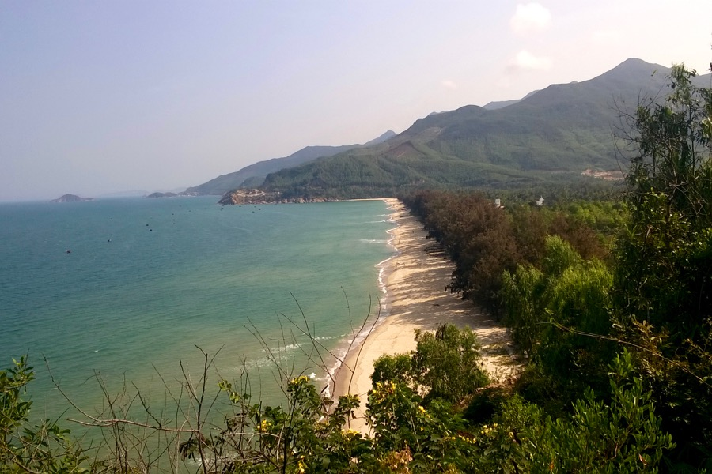

The South China Sea has an average surface salinity of 33 g/l, as opposed to the 38 g/l of the Mediterranean Sea, which makes post-bath itching and dryness of the skin less noticable. 

[Cham](https://www.britannica.com/place/Champa-ancient-kingdom-Indochina) temple in Quy Nhon
 
