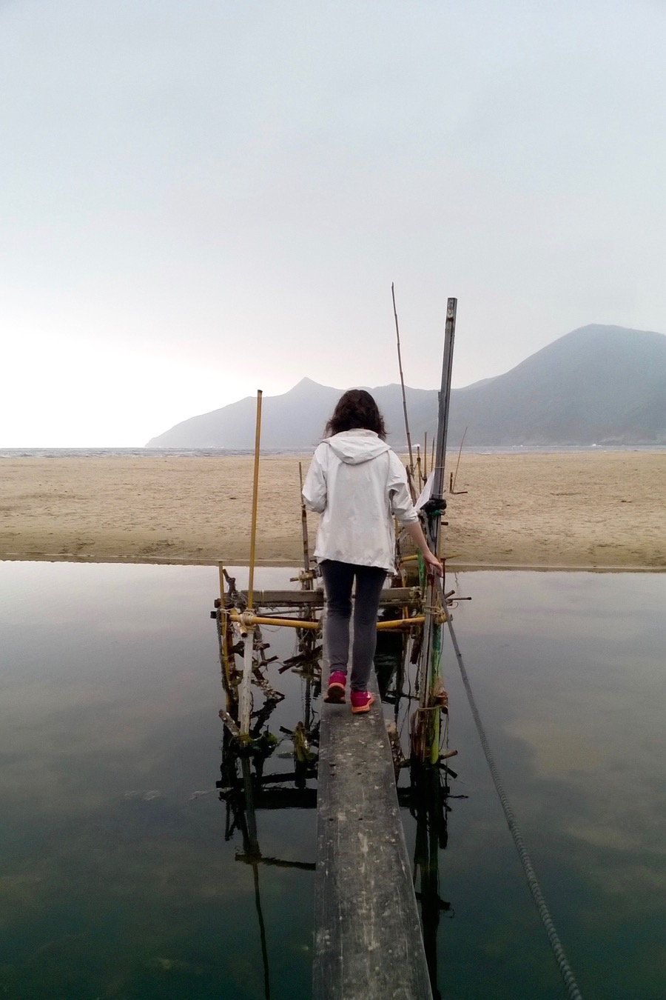

We almost forgot to write about how we could only take 5 kg on board on the Shanghai – Hong Kong flight. Our bags are about 8 kg each, but we outsmarted the system and got our bags cabin-approved. Our coat pockets were full of our heaviest items, and we were wearing most of our clothes.

After a month in Shanghai, we are still in big need of nature and fresh air, so we spent this afternoon hiking, too. We chose the beautiful Sai Kung Country Park, and we ended up in a gorgeous beach.

When we were hiking back along the tropical forest, we heared some strange stearing from the canopy: cracking, rumbling, eerie noises. It was a troop of real monkeys, nothing less! 

