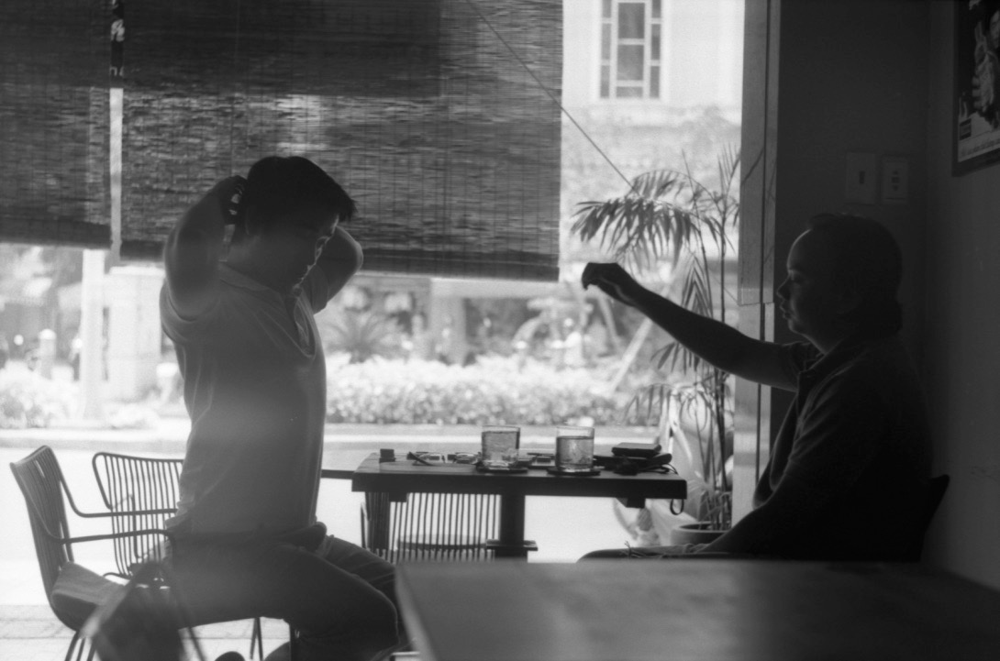

Saigon (Ho Chi Minh City) is a buzzing metropolis, but seems suprisingly livable. Our best experience was that we met some of our good friends from Budapest here.

It felt strange and familiar at the same time, seeing each other at another side of the planet. For Samu's birthday, we had supper at a small place on the street, we drank beer, and instead of a cake, we had some awkward, sugary fruit salad.

The following day, we tried to escape the heat in a shady park, accompanied by some cans of Saigon Special beer.
