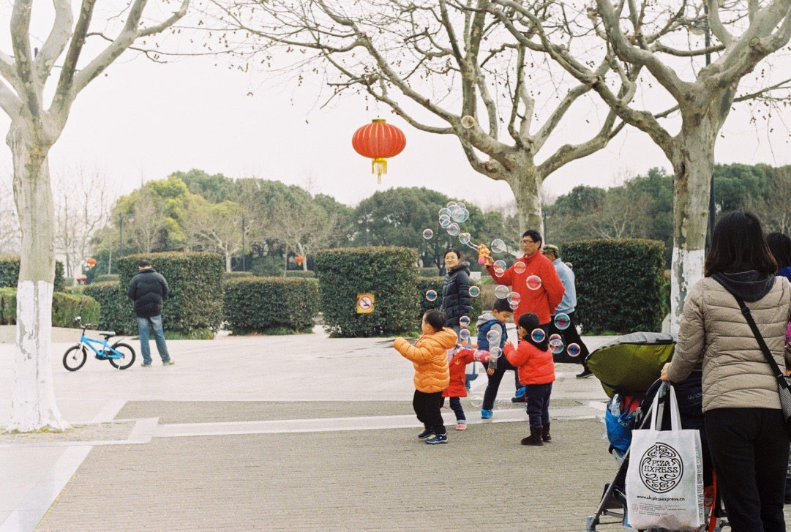
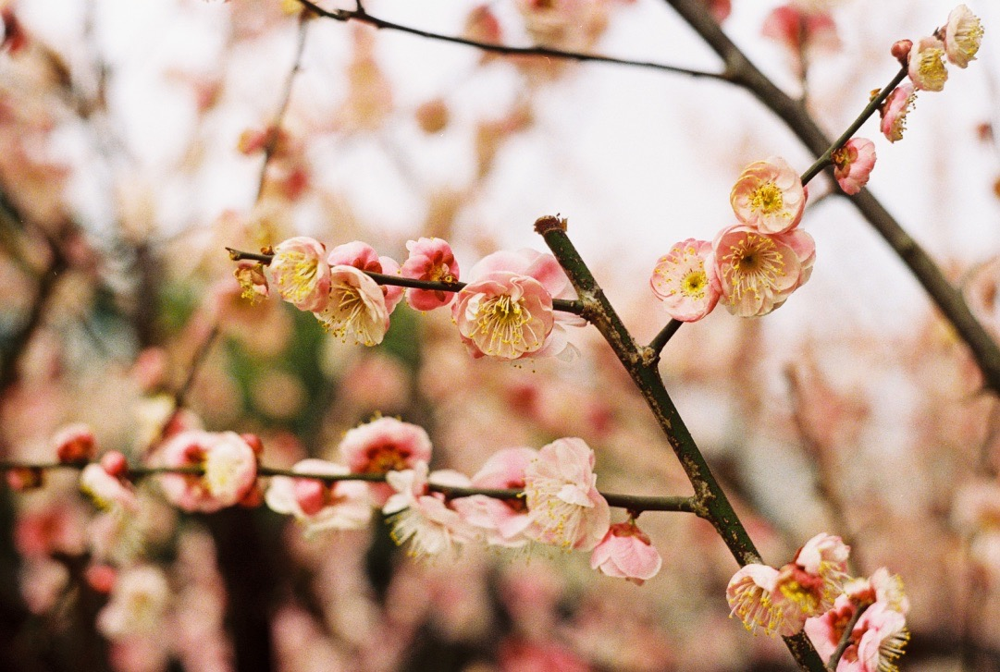
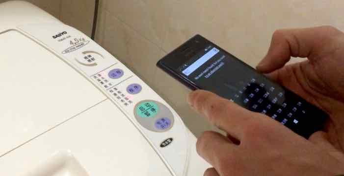

Japan is not the only place to see cherry blossoms. However, Chinese parks have far more concrete than we would expect from a park. Shanghai’s Century Park is its biggest (6 km to run around), and it’s 10 minutes walk from our place.

  
  

### Doing laundry in China

As we packed light, we already had to do some laundry this afternoon. It was not as easy as we’d expected — all the washing machine’s instructions and buttons are in Chinese, and lack any pictograms.

No surprise that we started to wash our delicate clothes as if they were bed linen, because its first character (毛) looks too similar to hand (手) for handwash. Luckily, we got unsure and checked the whole program selection in the dictionary. Our clothes are safe and clean now :)   

Our lunch was terrible, although a sign claimed the place was "satisfactory".
