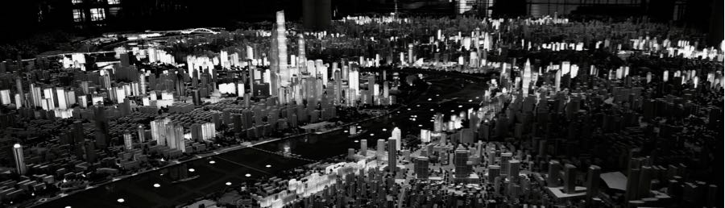
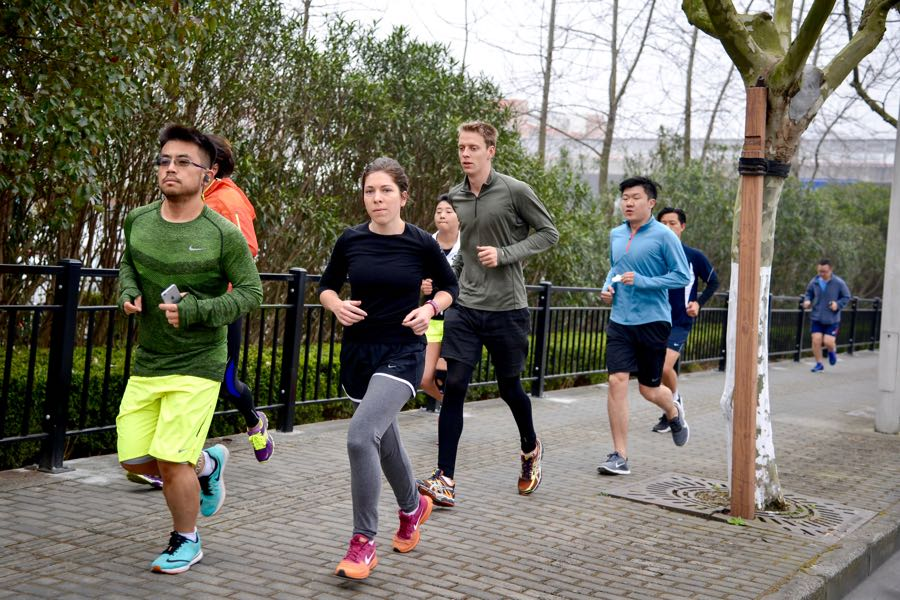
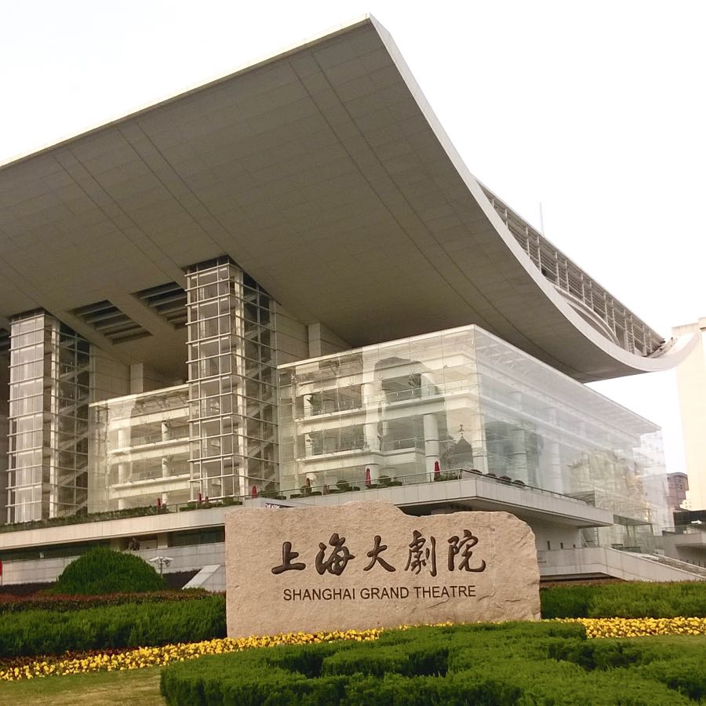
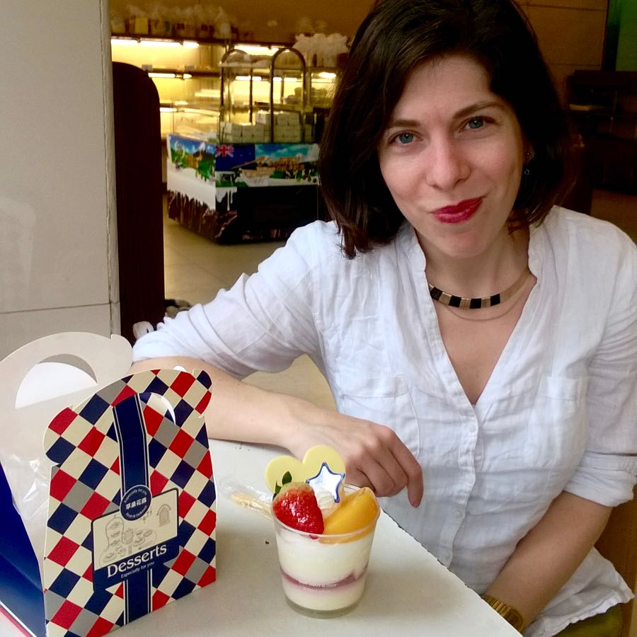

The past couple of days we were involved in the following activities:
- ran with the NIKE running club (10 km) and an urban running meetup group (6 x 1000 m on track)
- strolled around downtown Shanghai and in the French concession
- we visited an urban planning hall where we saw an awesome model of the city
- went to a cake shop
- planned our further destinations and bought 6 plane tickets
- made the blog available in English
- continued our online education

  

And we did not do any of the following:
- drink good quality coffee
- breathe good quality air

