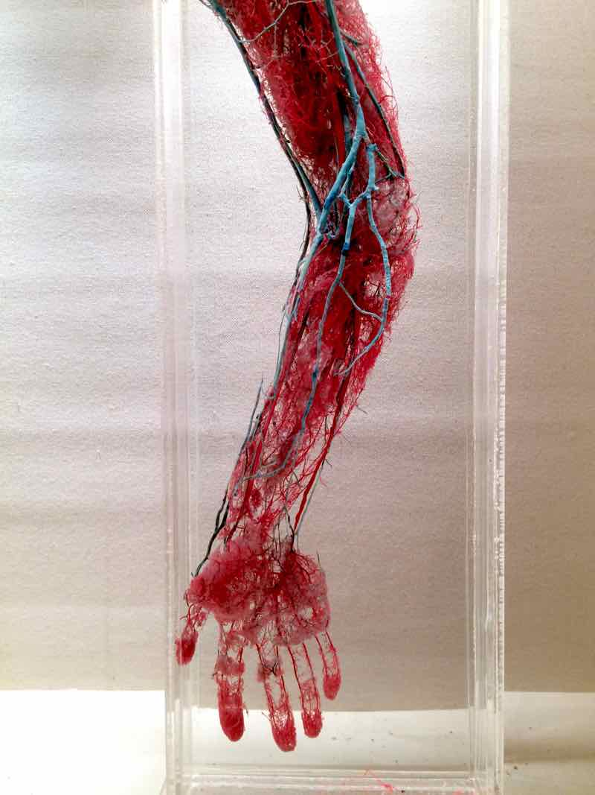
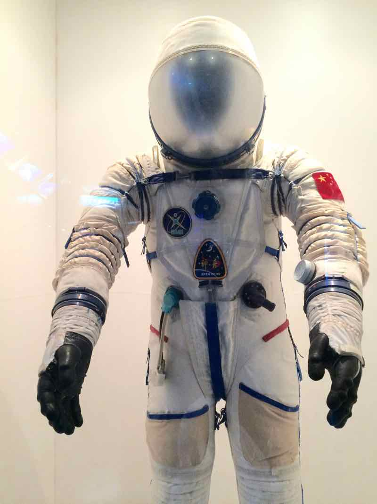
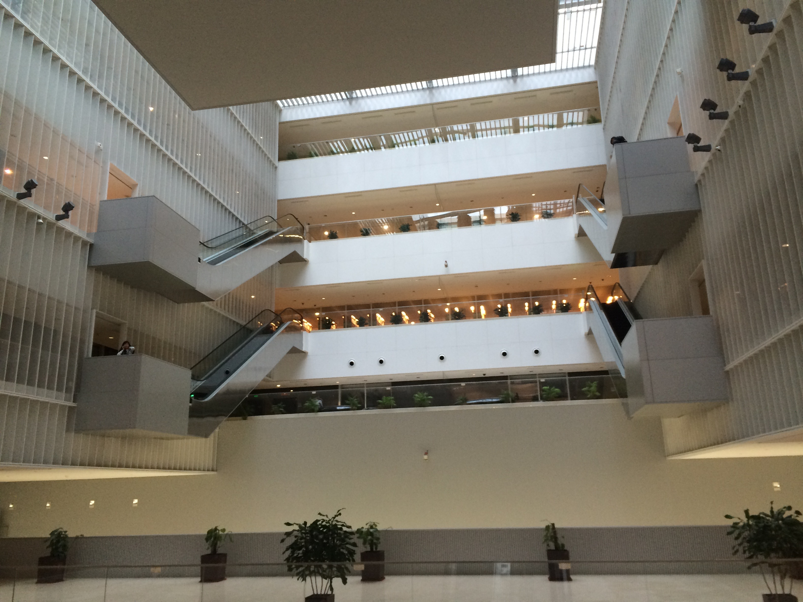
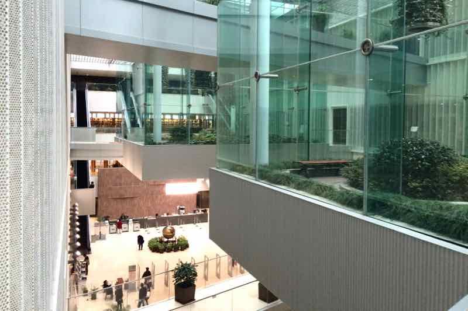

We went for a date to Starbucks last night (where the staff spoke exceptionally good English and called Samu 'Sir'), so we didn't blog yesterday. You only missed that we unfortunately saw eels at the market. Today, it will be all about Shanghai Museum of Science and Technology.

Our hosts told us that the museum was more for children. We loved it.

Museums are perfect for picking up new words: everything has its name written on it in English and Chinese. Our favourites:

动物 moving thing = animal  
海象 sea elephant = walrus  
袋鼠 mouse with pocket = kangaroo  
河马 river horse = hippo  
狮 (hair + master) = lion.

The museum is a strange mix of very serious stuff (think the full blood vessel system of a human hand in 1:1 size, and robots solving Rubik's cube), next a to quite dumb-looking plastic model of the human body, reminding us of biology class back in high school, then artificial stuffed copies of cloned animals (yeah, we could open an exhibition of drawings of cloned animals too).

Today, we ordered our lunch in Chinese in our favourite place. Apart from the salmiaki-flavoured bits, we mostly got what we wanted.

We spent the afternoon with some online courses (we totally recommend [Coursera](http://coursera.org/)) in Pudong Library. Quite a cool place, we must add.

