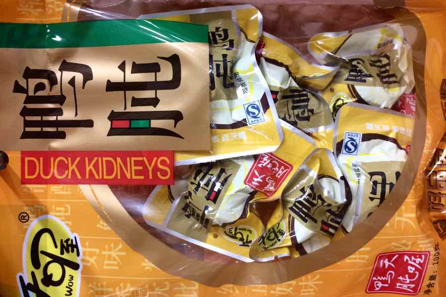

We forgot to mention that we saw an overweight man yesterday (he was not Chinese).

Before lunch, we looked up most of our favourite eatery’s menu in the dictionary. Turns out, they serve eels too. Eww... 

Exploring a supermarket is often more interesting than a museum. Strolling around in shops is a perfect language class (everything has its name written on it), and it’s fun. Of course, there are huge differences in the selection: there’s a full row of toothpaste, razor blades are next to impossible to find, and we had to ask an employee to open the locked glass shelves for a Nescafé. Some things that can be bought, below:

We are off to Nanjing tomorrow, we’ll be back Saturday. 
