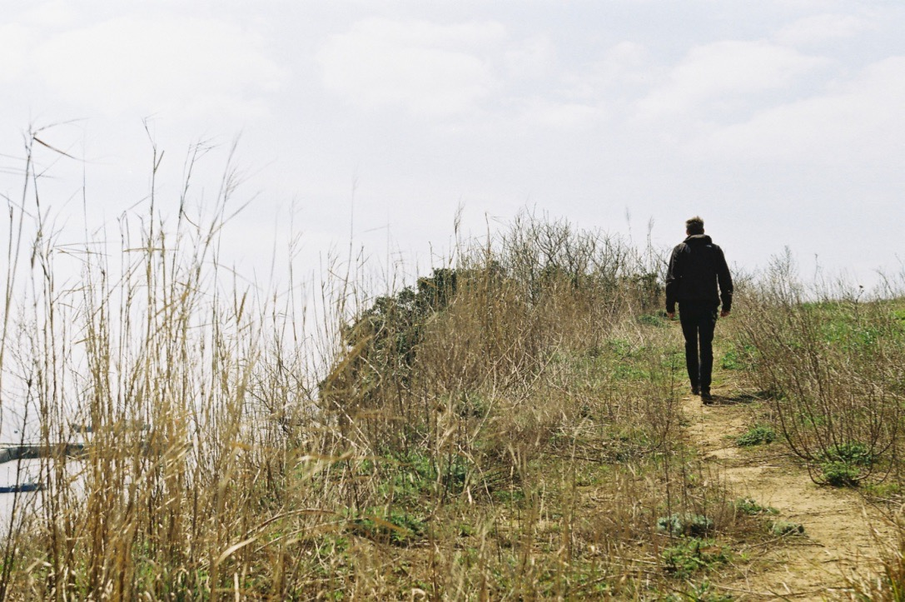
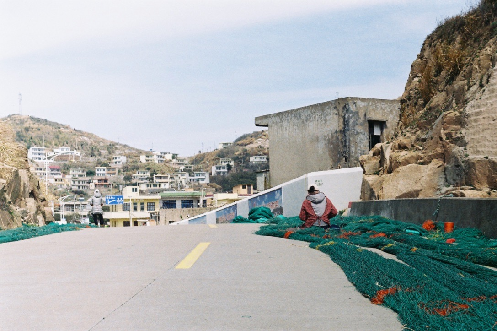
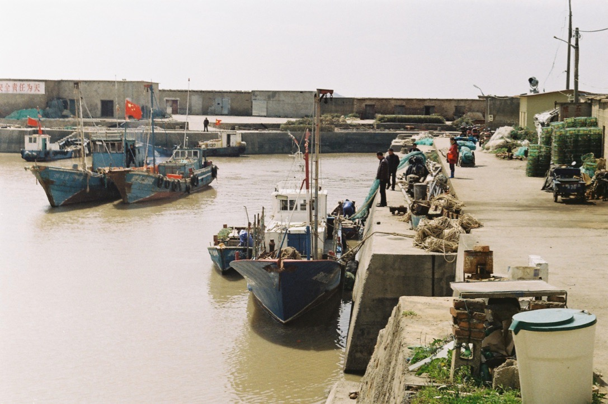
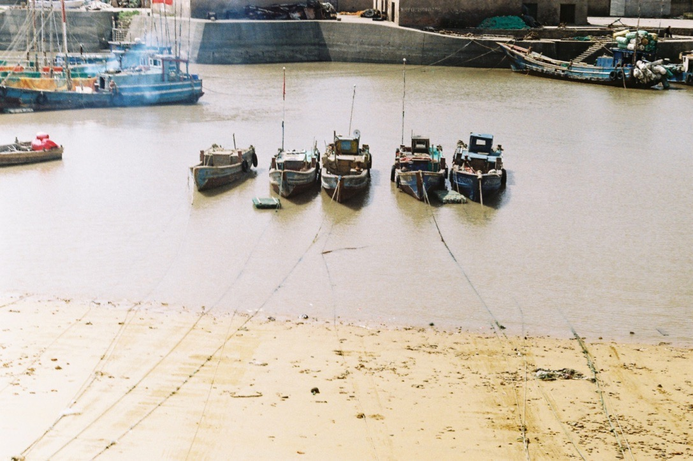
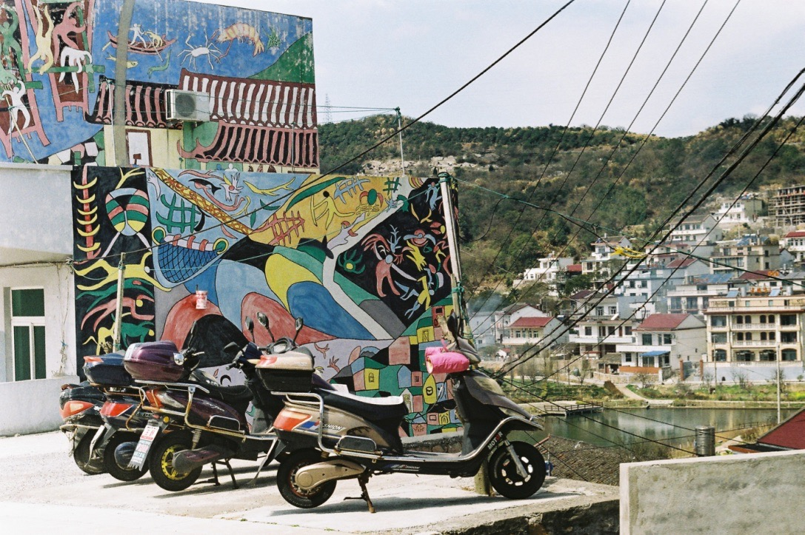
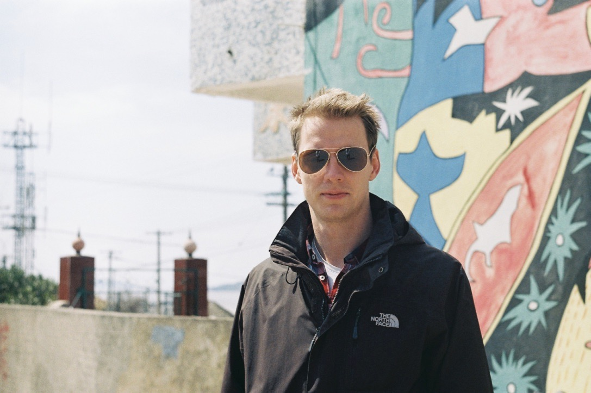

On our weekend getaway (which happened to fall on a Tuesday and Wednesday), we went to the Shengsi islands. We met a kind English teacher on the ferry, a so called “Jane”, who, despite having spent only ten days abroad in her lifetime (a recent trip to New Zealand with the class), spoke great English. She initiated the conversation and gave us plenty of advice about what to see on the island.

It's a true fishing island with small fishing villages, the smell of diesel oil and dried fish, shrimp, and crabs. Women are weaving fishnets on the side of the street. The sea is murky, muddy and seems very dirty, probably due to the clay that makes up the shore and dissolves in the water, with the old-rotten fishing boats adding their excrement to the mixture.

But still, the island is a much more relaxed place than Shanghai, calm and clean, it has a laid-back atmoshpere in general, and people were welcoming and friendly. It felt good to spend some time here after the busy metropolis.

On the bus, people would always offer their seats to us — even to Samu, because they saw that standing crooked is not much fun, for the ceiling was around at shoulder-height for him.

When we asked an officer (whom we address as shifu = master) about directions, he made sure we got it right and also used his walkie-talkie to notify his colleague at the next intersection, who continued to guide us to the bus stop we were looking for.

We wanted to have some beer in the evening, but had no opener, so Samu went downstairs to the reception to have them opened. He saw that four people, including the receptionist, were closely inspecting something on the table. They were staring at our passports, open at the page with our photo. That was cute. Even after 20 minutes, while we were sipping beer in our room, we heard them loudly talking about us — *„They come from Hungary! HUN-GA-RY!”.*

We were quite an attracion. 
