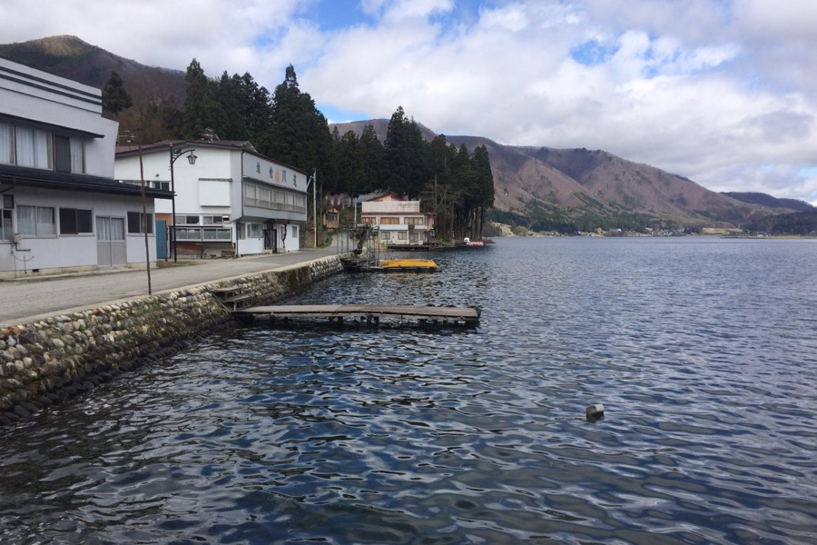
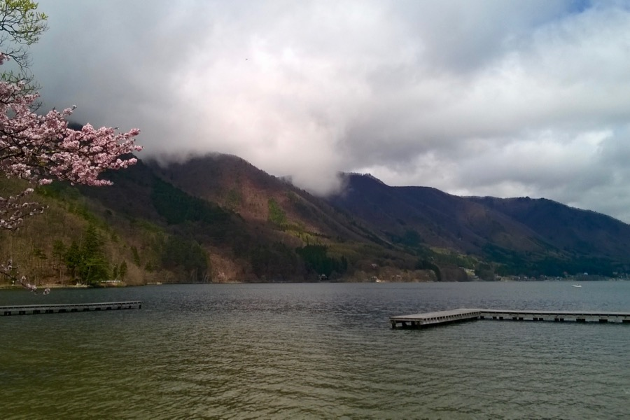
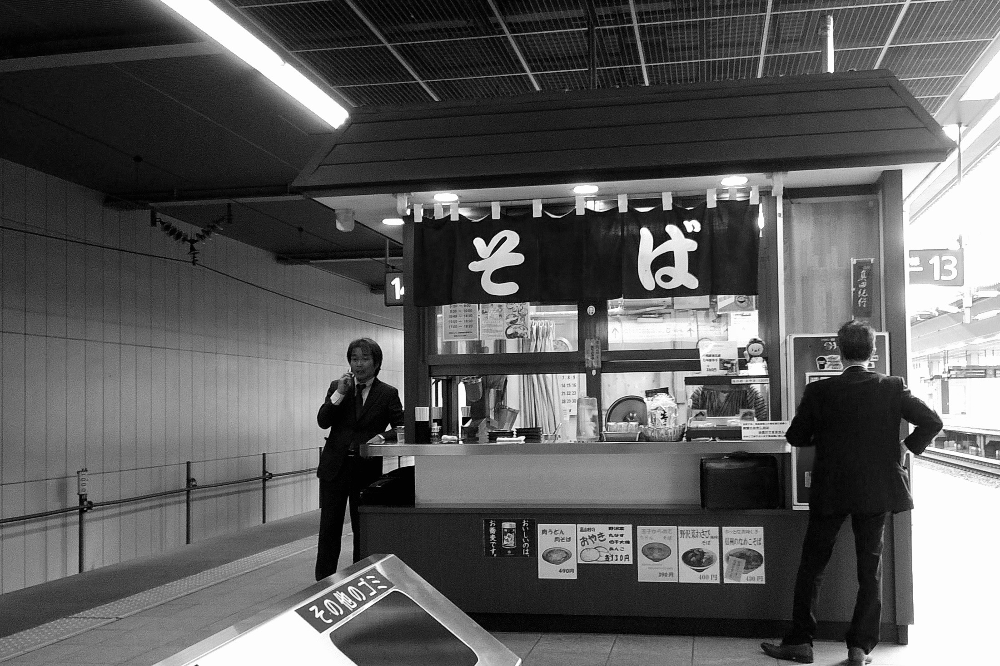

Our host, Kazuhiro, gave us a ride to Shinano-Kizaki, on the Southern tip of the lake Kizaki, a beautiful lake with clear water, cedar woods and nobody around. Perfect for a stroll.

## The onsen

After snapping some photos and looking around, we headed to the local public bath. The ticket for the onsen can be obtained from a teller machine, then you have to give it to the receptionist and decipher your way to the pools. Before entering one of the tubs, you have to wash yourself thouroughly with soap. The hot tub feels too hot at first, it is much warmer than at home... must be above 42 degrees celsius.

Next to the big pool, there's a sauna, and behind it, there is a cold-water tub with truly cold water, not just lukewarm. This is the real deal, below 17 degrees (estimated). This conludes that it is the best spa/bath we have ever been to. The pool which is situated outside is quite hot too, but the wind against your face makes a nice balance. It is a truly great place. 

After the bath, our biggest problem was deciding what kind of ice cream to choose with the chocolate milk — both were available from vending machines. 

---

We found our train station which seemed like no train would ever come here — deserted, isolated. To our surprise there was a train coming, and we hurriedly ran to the platform on the opposite side, for we have not yet accustomed to left-side transportation... 

Halfway to Matsumoto, a middle-aged couple sat down next to us and immediately started chatting with us. They spoke very good English (the lady had friends in Hawaii and the man was a professor of statistical quality control). He laughed a lot and made puns all the time. *“Most Japanese are shy, but I am shiny...”* — then he showed us his bald and shiny head... His wife was apologizing after each joke. They asked us how we liked Japan and if we could eat natto. The lady gave us small, apple-flavored Kit-Kats — she said the area is an apple-producing land.

The Japanese railway is a fascinating experience. Everything works as expected, which is quite unexpected. For Europeans (especially for Hungarians), the lack of delays and queueing, the neat and clean stations are all foreign. It took us about two minutes to reserve our ticket back to Tokyo, even though we had extra requests — we wanted to have an hour of free time in Nagano.

Again we ate at a small place on the platform — eating duck-soup with mountains in the background was a great experience.
