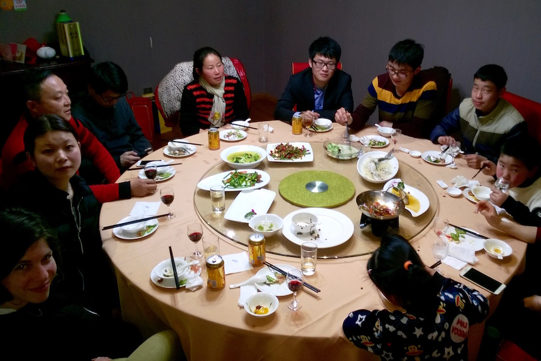
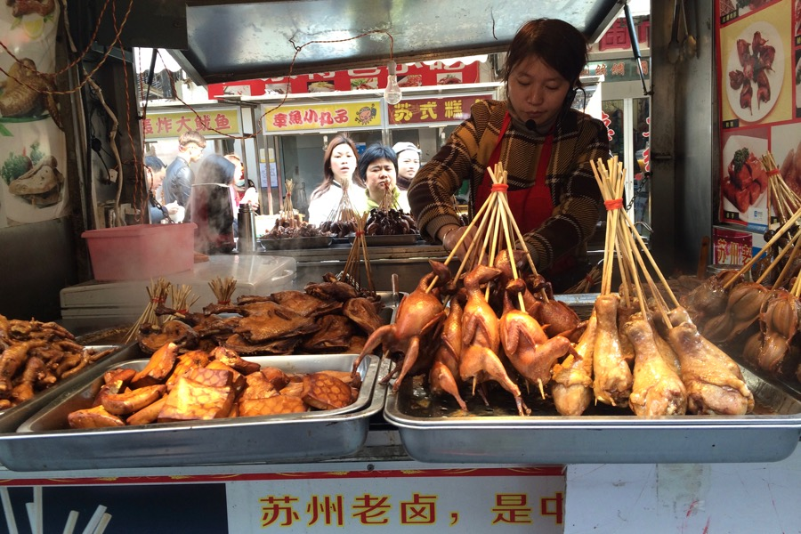
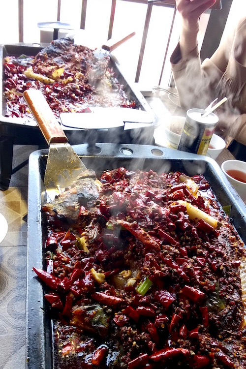
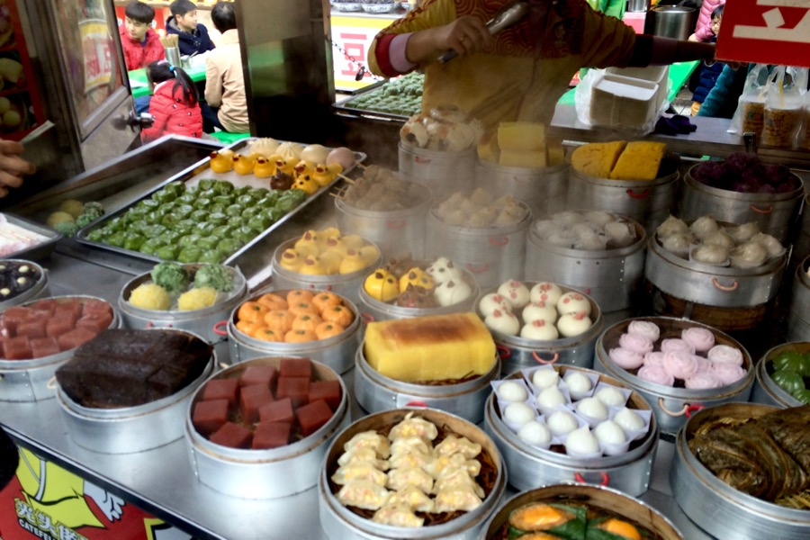

Our trip to Suzhou turned out well. Our friend from the train was extremely kind to us (we still don't know her name, though). She was proud to introduce us to her family, and her parents were proud that their daugther has foreign friends. Perhaps us, young westerners represent everything that a youngster from the suburbs of Shanghai could dream of.

We were taken to a restaurant, where we ate numb and spicy fish, drank coconut milk and herbal tea.

They took us everywhere by car, and didn't let us pay for anything — they even bought our train ticket home, after they have taken us to the train station.

We also got spoiled with:
- bunny-ear shaped hairclips
- lollipops
- fried octopus balls.

In the evening, we had dinner with the family, which was the most surreal in this surreal experience. It was good.

