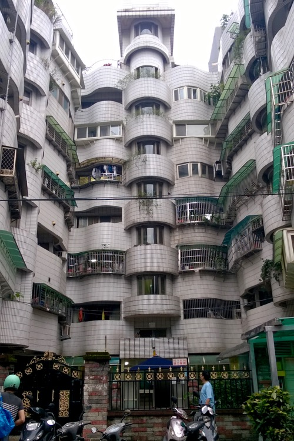
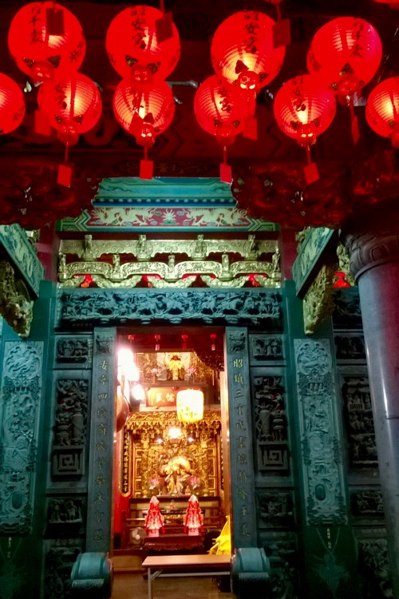

Yesterday we went to a swimming pool. It was refreshing, we felt reborn after swimming, sauna and steam chamber.

Today was sporty as well: track running and swimming in another pool. The local running track (excellent in quality) was filled with people in the evening and the pool was great too. We were starving afterwards, the emptiness in our stomachs lead us to a nightmarket. First we ate a bag of chopped chicken, vegetables, quail egg and sausages. Then we had unbelivably crispy and tender fried chicken bits. 

We can understand enough of Taiwanese Mandarin to get by, which is surprising. 

