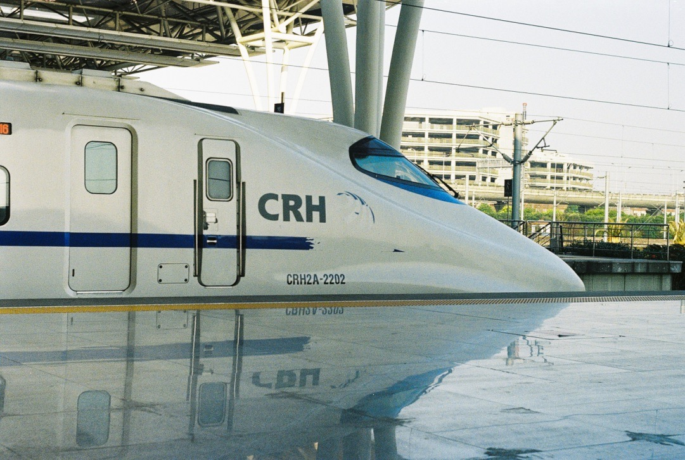
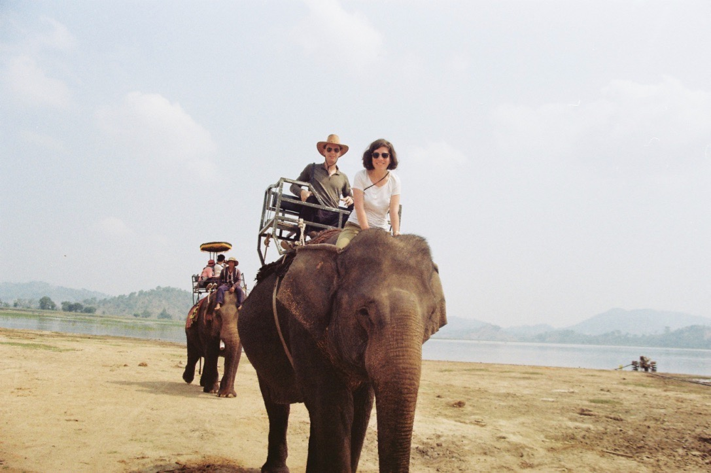
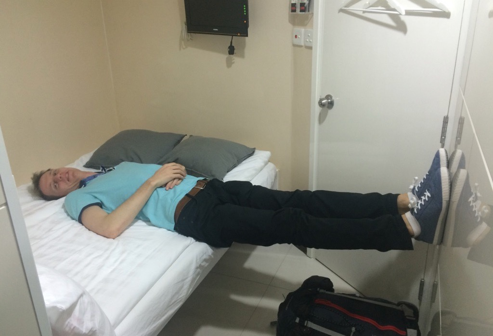
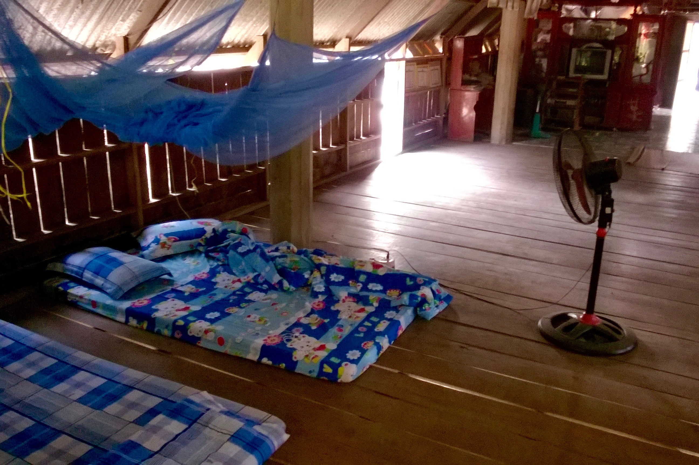
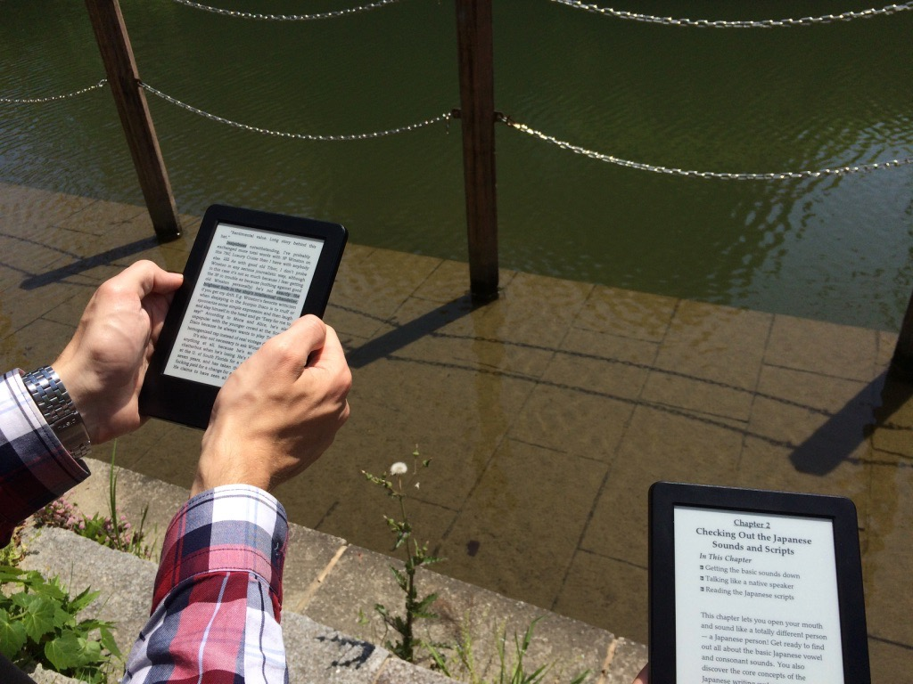
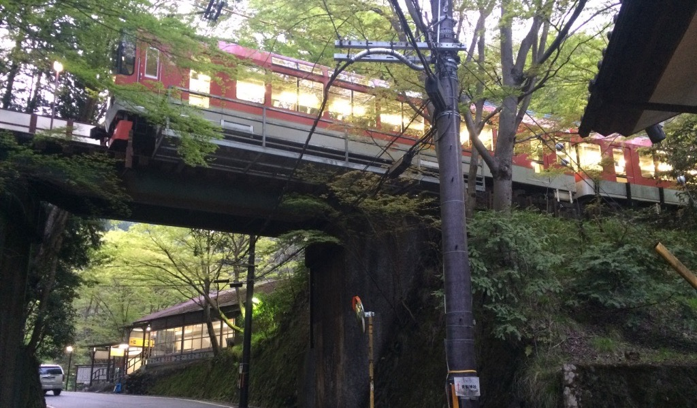
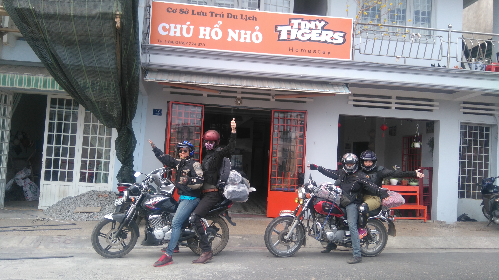
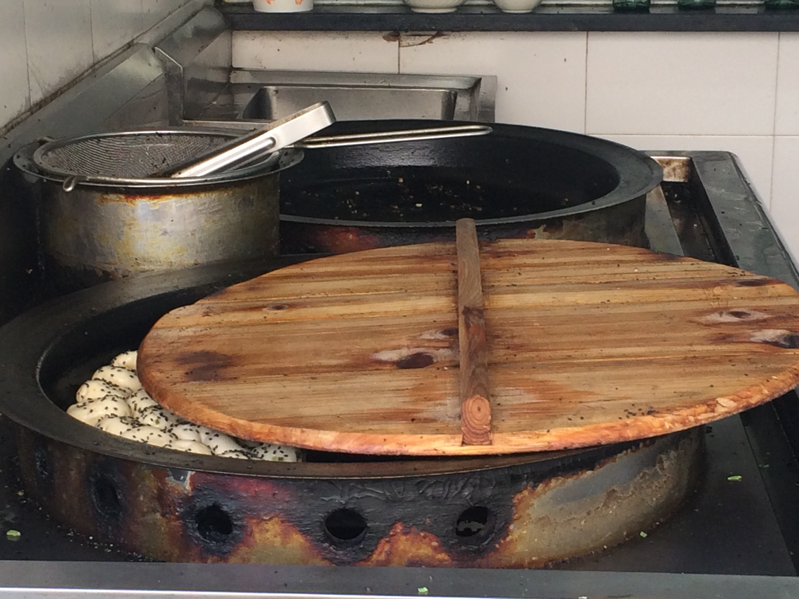

From June 2nd, we continue our adventures in Europe, so this is the end of our Asian blog. If it continues, we will let you know. Here follows the best, worst, and a summary of the rest.

We have travelled by plane, car, taxi, scooter-taxi, songthaew (pick-up taxi), bus, train, shinkansen, motorbike, bicycle, elephant, underground, double-decker tram, ferry, speed boat, ship, and on foot. 

We have been to kingdoms, communist countries, a special administrative region, and a country which is not officially acknowledged by most of the others (the Vatican is the only one in Europe to recognise Taiwan). 

The cheapest room we paid for cost 8 EUR (in Quy Nhon, Vietnam, with balcony and sea view), and the most expensive was 48 EUR (in Hong Kong, without windows, and Samu could barely stretch his arms inside). Our cheapest meals were in Vietnam, a filling soup or banh mi (a delicious sandwich) for 0.40 EUR. The relatively most expensive thing we ate was a 2-EUR apple in Kyoto, Japan.

### What did we learn?

__To pack like a pro__ — Our personal best is fitting 8 kg hand luggage into the 5 kg allowance. We never had to check our bags in, and most of the times they didn’t even weigh our backpacks.

__To eat with chopsticks__ — Actually, it is more comfortable than with a knife and fork. They are easy to wash, don’t make scratching sounds, and anyways, if you have a utensil in each of your hands, how do you hold the plate? In fact, we can eat anything with chopsticks. Rice pudding with jam? No problem.

__To haggle__ — For fried prawn pie, hotel rooms, bike rentals, and so on.

__To get up early__ — Kyoto’s thousands of red torii gates are a major attraction, and usually packed with tourists. But not at 6.30am!

__To live without a washing machine__ — It is painful, but survivable. A sink and any soap, and a bit of muscle can do the job.

__To ask, and to stand for our rights__ — There was no multi-day tour to Ko Tan island, but we asked the operator if they can make an exception, and they could. In Saigon, getting into the room we rented was a daily struggle, to the point where we asked for a full refund. We got it.

__What is important for us in our daily life:__
- Good, clean drinking tap water.
- Bread. Decent bread, not that sweet spongy mass.
- Nature in an accessible distance. At home, Gellért hill is close, but within an hour’s journey we can be in the middle of a forest.
- Cleanliness in our surroundings. Clean air, clean streets. No wonder that arriving to Japan was a delight.
- Effective and reasonable public transport. Huge Lexus (Shanghai) or ugly, noisy scooters (Vietnam & Thailand) shouldn’t be the most popular means of transport.
- Walking. In most of the places, it was quite difficult to go for a walk. In China, spitting, smoking people knock you over. In Vietnam and Thailand, scooters park on the pavement, but in Thailand, there is mostly no pavement. You can’t speak two words without taxi drivers tooting or shouting “Taxi!” (thanks, but no thanks), or “Hello”-ing from restaurants (again, thanks, but we don’t go to those restaurants).
- People we meet daily. The tribe we live in. Things that we take for granted, like meeting someone for a coffee or a quick lunch, talk and have a glass of beer or wine.
- Feedback on our work or anything else.
- Coffee. Not only exquisite Italian espresso, sometimes a simple Nescafé will do.

### Our favourite items from our backpacks
- __Kindle__ — We have far more time for reading than usual, and anyway, you can never take enough books for a long journey. Our Kindles saved us from going crazy when there was no internet for three days, and for a day, no electricity either.
- __Merino wool clothing__ — They are still in perfect condition (much better than their non-merino companions) after months of frequent wearing. They don’t smell even after weeks, you just have to air them sometimes.
- __Soap__ — It was provided in most of the places we stayed at, but when not, it was essential.
- __Running shoes__ — To run, walk, hike. We did use them quite a lot, we have run 280 kms since February.

### Things that should be immediately imported to Europe
- Shinkansen (Japan)
- Vending machines selling cans of hot coffee (Japan)
- “The best thing that can happen to a chicken”-vendors from Taiwan (see _food_).

### The best things and places
- JAPAN!!! In Japan, everything is interesting. Atami, the onsen in Shinano-Kizaki, and that the whole country looks like _The Busy World of Richard Scarry_.
- Motorbike tour in Vietnam
- Lots of working out in Taipei (there are running tracks and full-sized swimming pools everywhere), and those delicious chicken bits… mmm…

### The best food and drink
- Shengjianbao (Shanghai) — Golden fried dumplings filled with meat and broth. Careful, hot inside!
- Banh mi (Vietnam) — Buns with a generous spread of lard, soy sauce and chilli sauce, filled with anything and everything the street vendor has. Rats love it too!
- Pho (Vietnamese soup) — Hot, spicy, delicious.
- Taiwanese crispy chicken bits — The best thing that can happen to a chicken.
- Slow-cooked chicken thighs in coconut milk and tomato (our own cooking) — The meat separates from the bone just by touching it.
- Green papaya salad with prawns, peanuts and lime… mmm!
- Vietnamese breakfast — We don’t know what this dish is called, but it is amazing. A huge serving of rice with four different types of meat and seafood.
- Red tuna sashimi (raw fish). Any kind of sashimi. Any kind of sushi.
- Soba (noodle soup) on the railway platform in Japan.
- Vietnamese coffee.
- ‘Kato’ brand fruit drinks with coconut meat in Thailand.
- Bubble tea (or literally, pearl milk tea).
- Mangoes, bananas, fresh coconut.
- Green tea chocolate, green tea ice cream, green tea anything (Japan).

### The most “interesting” food and drink
- Natto (Japan): fermented soy beans with mustard. Mustard makes it way better. (In Japan, it is not uncommon to ask foreigners if they can eat natto. We can, but we prefer not to.)
- Fish and meat full of bones in China. What is the sense of a dish of which 75% is inedible?
- Undercooked broccoli (apparently, Chinese can spoil the simple task of cooking a broccoli).
- Chinese “wine”.
- Chinese “beer” with 2–3% alcohol.
- Vending machine sake in Japan (ok, ok, we shouldn’t have bought sake from a vending machine).
- Jellyfish soup in Vietnam. We have no idea what the jellyfish-like things were in the soup, but they could easily have been baby jellyfish.
- Salmiaki-flavoured fried rice in China. Yuck.
- Rice wine disguised as beer in Thailand. We thought it was beer! It was quite a disappointment (worse than the vending machine sake in Japan). We threw it away immediately.
- Sweets in general.
- Something that looked like eel larvae in Japan. Maybe it was not eel, we don’t know for sure, but it didn’t look appetising. It tasted very good though.

Itʼs been fun. Go away if you have the chance. 

