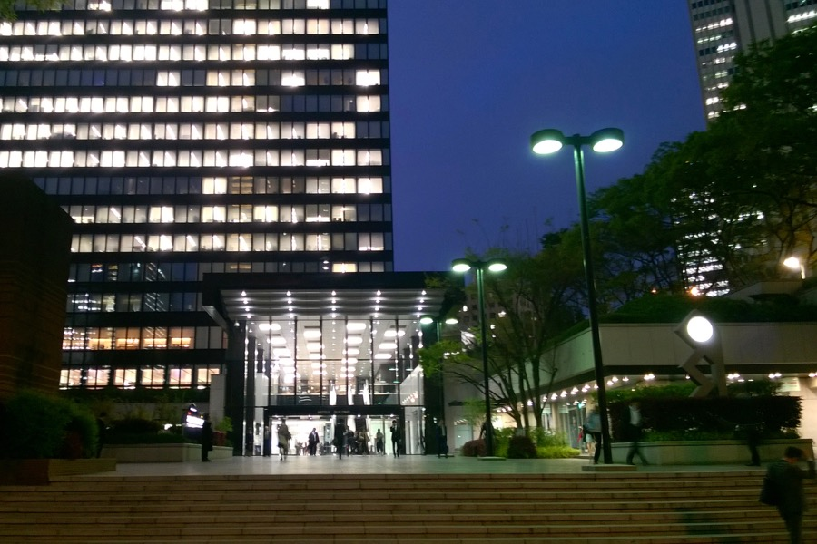
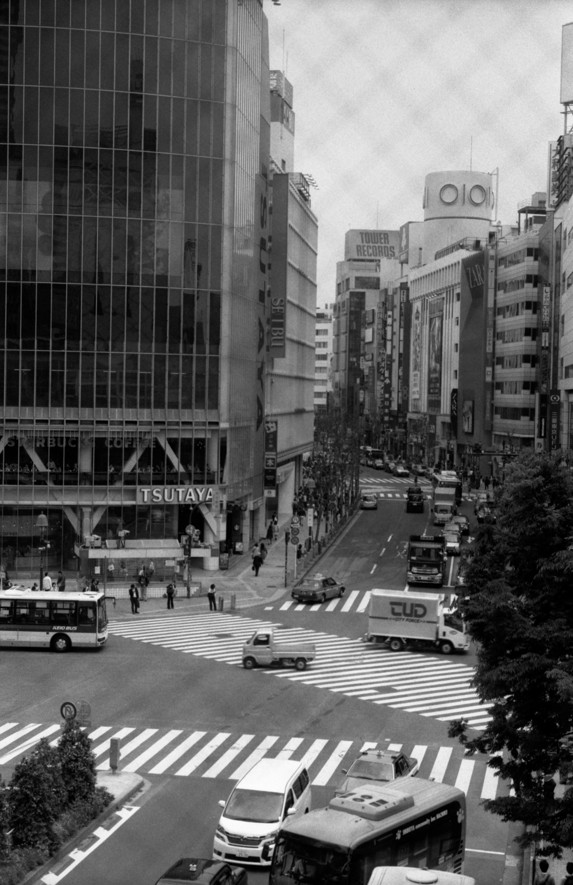
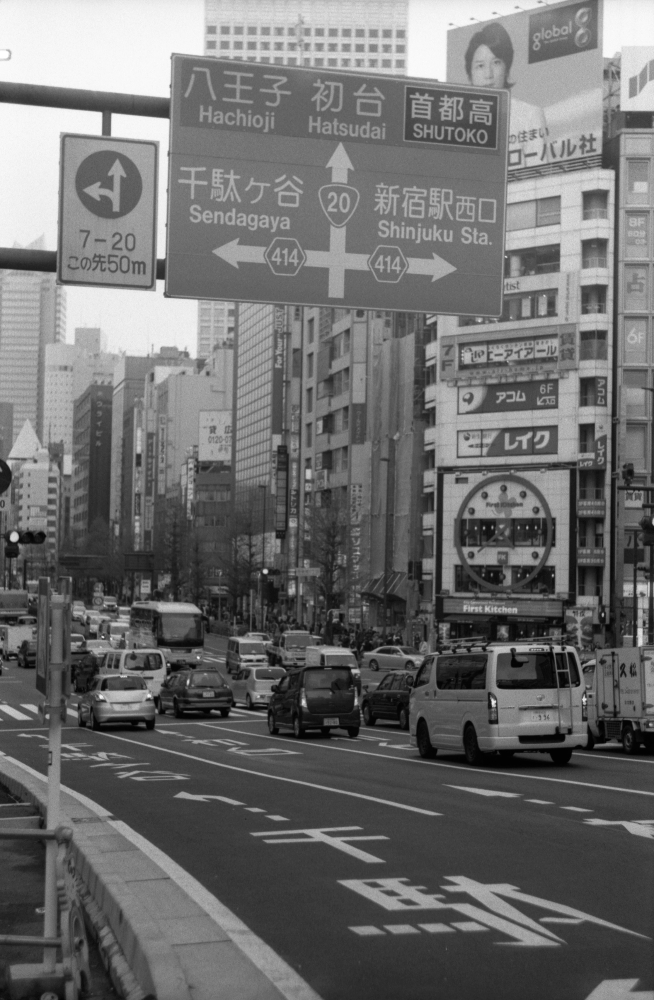
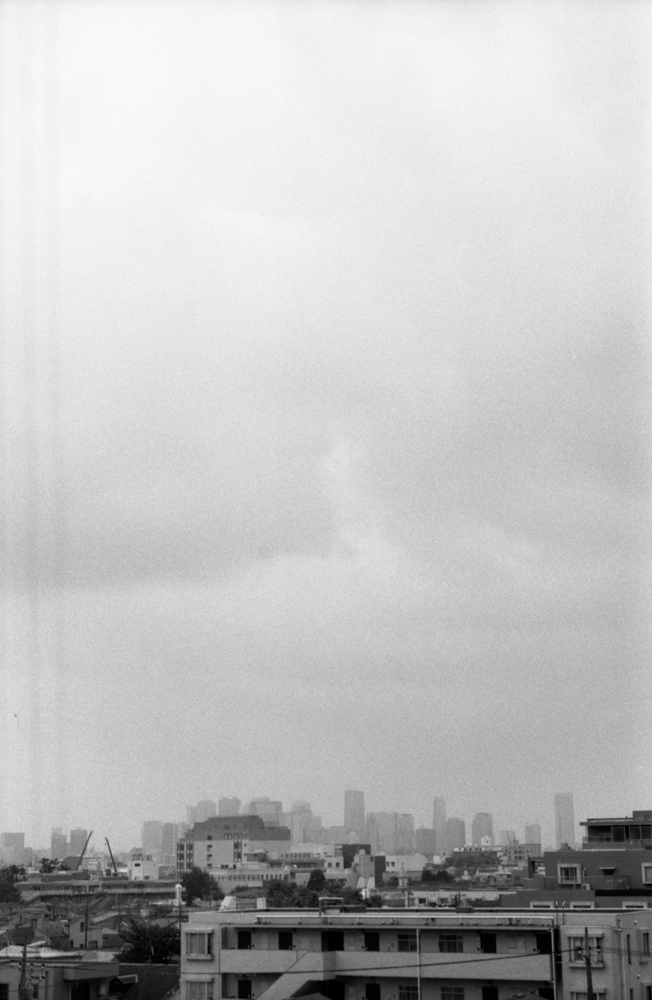

<video src="/video/jp_tokyo.mp4" poster="/video/jp_tokyo.png" autoplay loop>
</video>

Tokyo is amazing, and we've bought bunny toothpaste. It tastes like bubble gum. 

In Japan:
- we have experienced a small earthquake
- the pedestrian paths at the airport are made of running tracks
- streets are not noisy at all
- everything is well-designed and clean
- there are 70 Fanta flavours
- vending machines sell cans of hot coffee
- there is an announcement on the underground asking people to mute their phones and not to speak, so that they don't disturb others.

We had a long walk among the futuristic skyscrapers of Shinjuku this afternoon. It felt like travelling in time, not in space.

