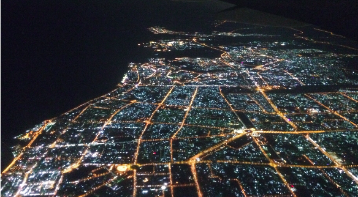

We have arrived in one piece.

About the trip:

- Budapest airport has a piano available for public use
- Emirates seem to be a nice company
- Californian merlot tastes good at 11 km altitude
- travelling with 8 kg each is a liberating experience (more about it later)
- we sat on the biggest passenger aircraft in the world (Airbus A380)
- our films were manually inspected at every airport so they did not have to suffer from x-ray
- we took the [maglev](https://en.wikipedia.org/wiki/Maglev) from Shanghai airport to the city. It took 8 minutes to travel 35 kms. Neat!

This is Dubai by night:

