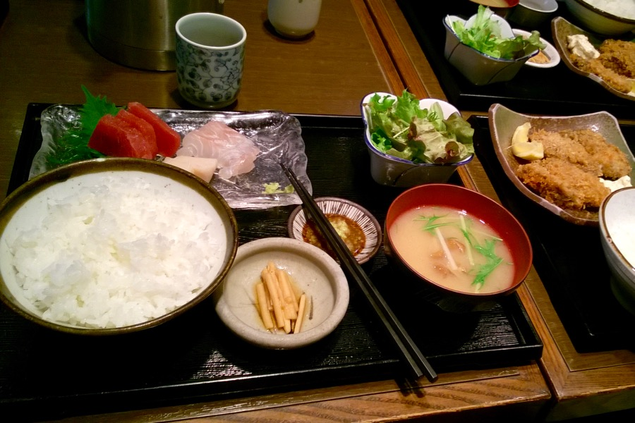
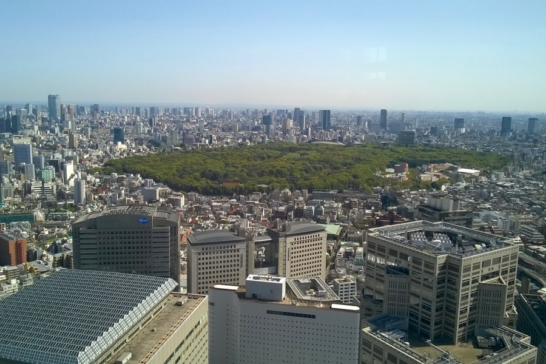

At the moment, Tokyo is our favourite city. Thanks to Samu's uncle, who has been living here for ages, perhaps we can see more than the glimpse of the average tourist. Shimokitazawa, for instance, is a charming, lively, but not too crowded neighbourhood with design shops, interesting bookshops, cute cafés, bars and restaurants.

The Toyko Metropolitan Building has a viewing deck at 202 m altitude, accessible free of charge.

