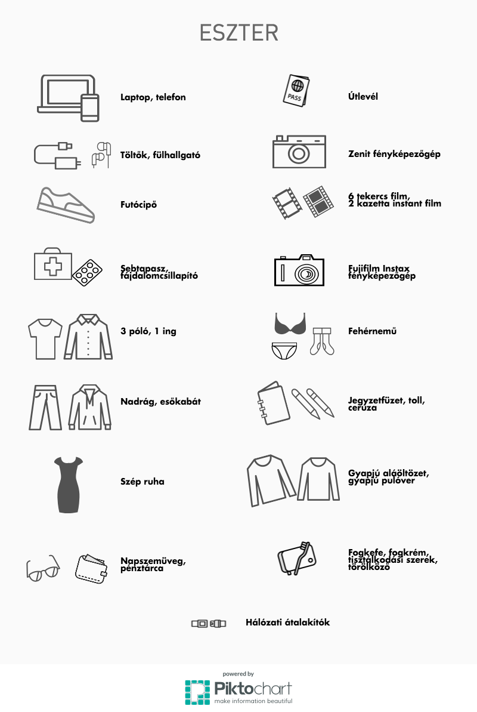
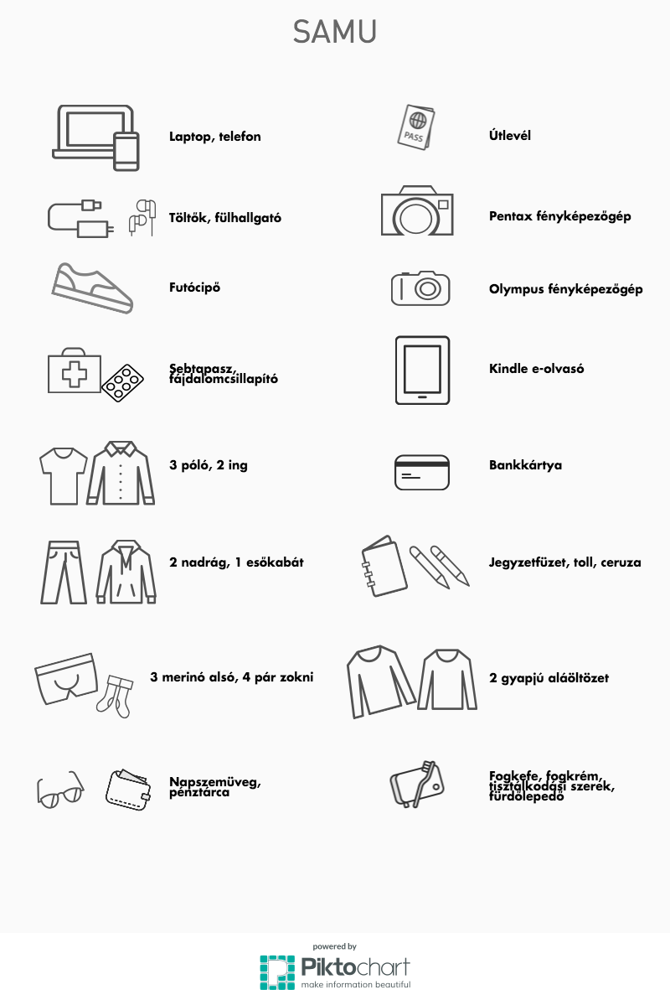

We spent most of this weekend in the library, on the running track (10 km!), relaxing, and cooking Hungarian goulash to our hosts. In today's edition we share how much we could fit in our bags of 8 kilograms.

Not much, but we prefer washing to heavy bags. We did it by:
- only packing one week's clothing (see: washing)
- using e-books instead of paper guidebooks
- some of our clothing is merino wool (light and odor-resistent, the best for travel)
- we packed mini versions of toiletries

Packing reminded us about the word__包, bao = bag__, so hereʼs todayʼs linguistics.

钱包 moneybag = wallet  
面包 pasta bag = bread  
包米 bag rice = corn  
打包 hit + bag = to take away (food)  
In the character 饱, “bag” with “food” root means to eat until full. Fill the bag with food — something like that.
