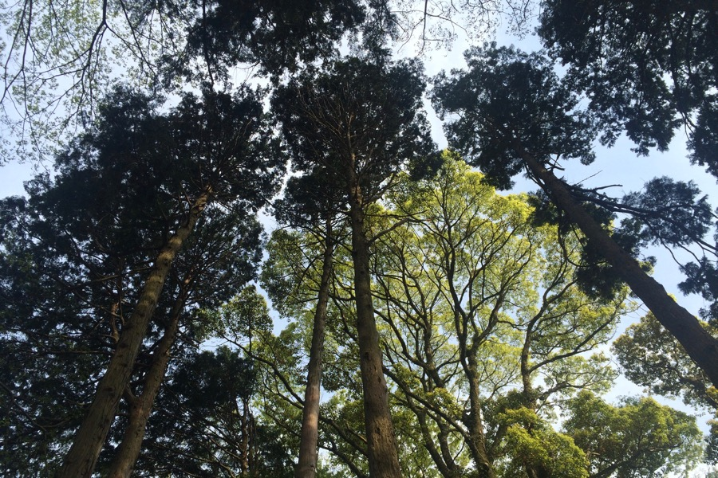

A tenger mellett fekvő Atamiban el lettünk kényeztetve. Onsen-ben háromszor is fürödtünk, előtte rituális, kötelező alapos tisztálkodásban vettünk részt. A fürdők naturisták és nem koedukáltak, vizük melegebb, mint az otthoniaké — nagyon jó buli.

Mint [Konrád és Ringelhuth bácsi csütörtökönként](http://www.mek.iif.hu/porta/szint/human/szepirod/kulfoldi/kastner/majus35/majus35.htm), mindenféle zagyvaságot ettünk össze. Például:

* fermentált szójababot mustárral (natto)
* zöldtea-pudingot
* friss tofut reszelt gyömbérrel
* átlátszó angolna-lárvát (Eszter ebben a pillanatban tudta meg, hogy angolnát evett)
* rengeteg nyers halat.

