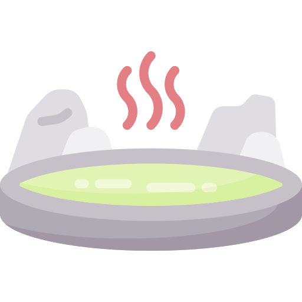
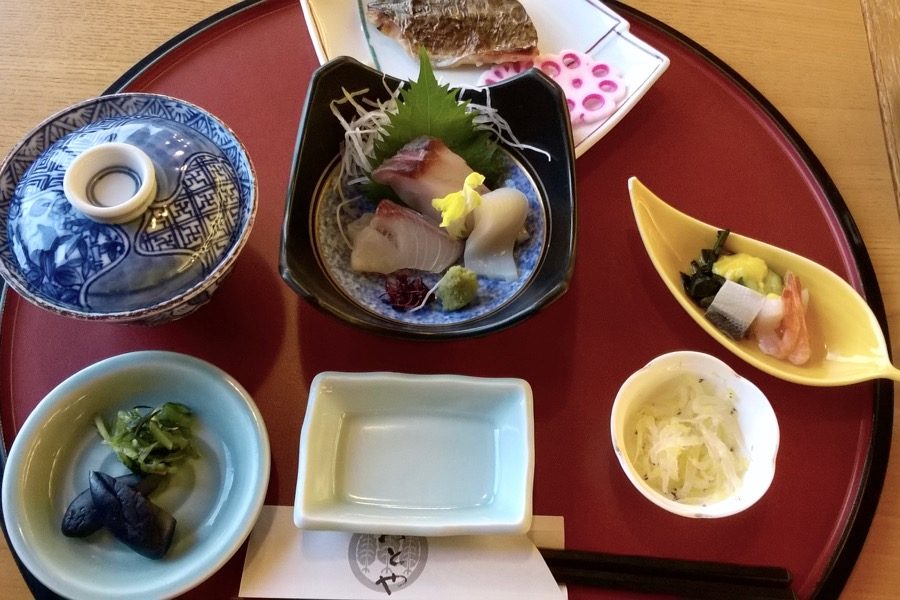

{.right-edge}

A tenger mellett fekvő Atamiban el lettünk kényeztetve. Onsen-ben háromszor is fürödtünk, előtte rituális, kötelező alapos tisztálkodásban vettünk részt. A fürdők naturisták és nem koedukáltak, vizük melegebb, mint az otthoniaké — nagyon jó buli. {.decoration}
{.clearfix .relative .text-xl .text-green-900 .font-serif}

{.with-bg .bg-blue-100 .-top-32 .-mb-16}

Mint [Konrád és Ringelhuth bácsi csütörtökönként](http://www.mek.iif.hu/porta/szint/human/szepirod/kulfoldi/kastner/majus35/majus35.htm), mindenféle zagyvaságot ettünk össze. Például:
{.mx-auto .w-8/12}
- fermentált szójababot mustárral (natto)
- zöldtea-pudingot
- friss tofut reszelt gyömbérrel
- átlátszó angolna-lárvát (Eszter ebben a pillanatban tudta meg, hogy angolnát evett)
- rengeteg nyers halat.
{.mx-auto .w-8/12}

[

]{.flex .gap-12 .mt-12}
