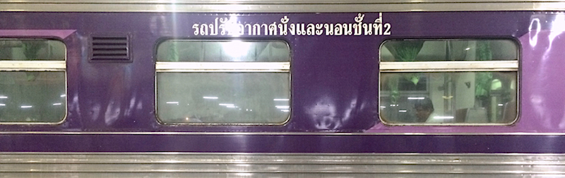

Voltunk már életünkben meleg helyen, de ez azért tényleg durva. Szabad levegőn gyakorlatilag nem lehet megmaradni, így a kötelező elintézendő (= vonatjegy átvétele) után bemenekültünk az első utunkba eső légkondicionált kávézóba, és vacsoráig ott is maradtunk.

Az esti kalóriákat a pályaudvar elhasznált étkezdéjében vettük magunkhoz (külön pultnál váltott étkezési jegyek fejében). A terembe belépve vegyi fegyvernek sem utolsó, chilivel sűrített levegő vágott orrba minket. Ennek megfelelően először egy eszméletlen-, majd egy brutálisan csípős ételt választottunk, rámutatásos módszerrel. A koszt egyébként kiváló.

Vacsora után a hangárjellegű váróban élveztük a helyi X-faktort, amelyet időnként egy magyar hangzású hangosbemondás szakított meg. (Egyébként egyáltalán nem hasonlít a hangzás, az írás pedig szerintünk kamu, ezek biztosan nem betűk.)

Ezen felül azt is felfedeztük, hogy felváltva járunk bal- és jobb oldalon vezető országokban. (Kína: jobb, Hong Kong: bal, Vietnám: jobb, Japán: bal, Tajvan: jobb, Thaiföld: bal.)
