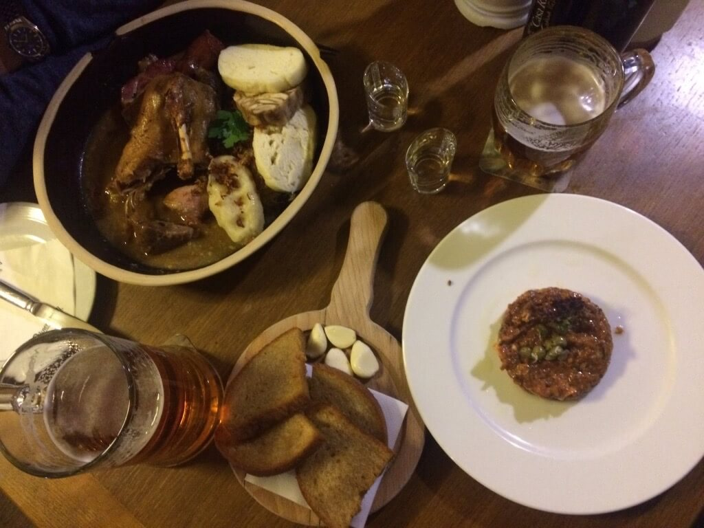
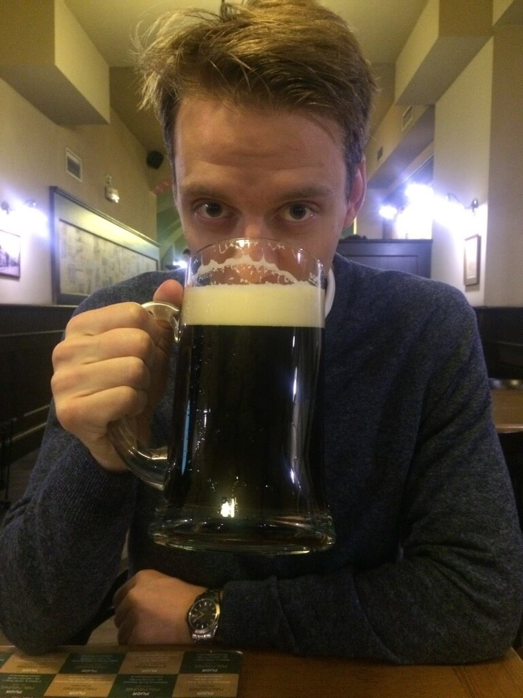
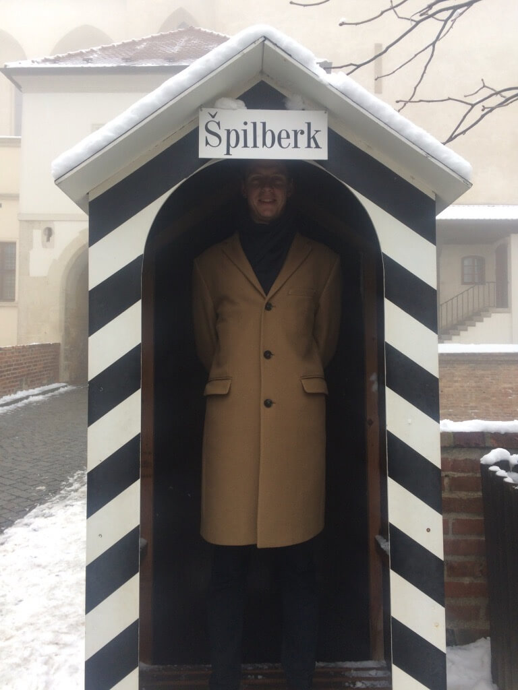

A Karácsonyt Bohumil Hrabal szülővárosában, Brno-ban töltöttük.

Ettünk négyféle állatot: csirkét, marhát (nyerset és sültet egyaránt), kacsát, sertést.

Ittunk hétféle sört: Starobrno-t, sötét Kozel-t, Pegas világost, Pegas sötétet, Pegas Karácsonyi kiadást, Pegas búzasört és Pilsner Urquellt. A Pegas söröket a névadó (= Pegazus) sörfőzdében fogyasztottuk.

Valamint megkóstoltunk négyféle röviditalt: Becherovkát, Borovickát, és egy külvárosi kocsmatársaság ízlésének köszönhetően Captain Morgant, és valami rettentő Captain Morgan-utánzatot is.

Játszottunk egy hatalmas xilofonon, sétáltunk középkori várban és sejtelmes ködben a félelmetes katedrális körül. (Tűkastély, tüskevár?)

25-én pedig együtt úsztunk a karácsonyi kalóriákat ledolgozni kívánó csehekkel.
