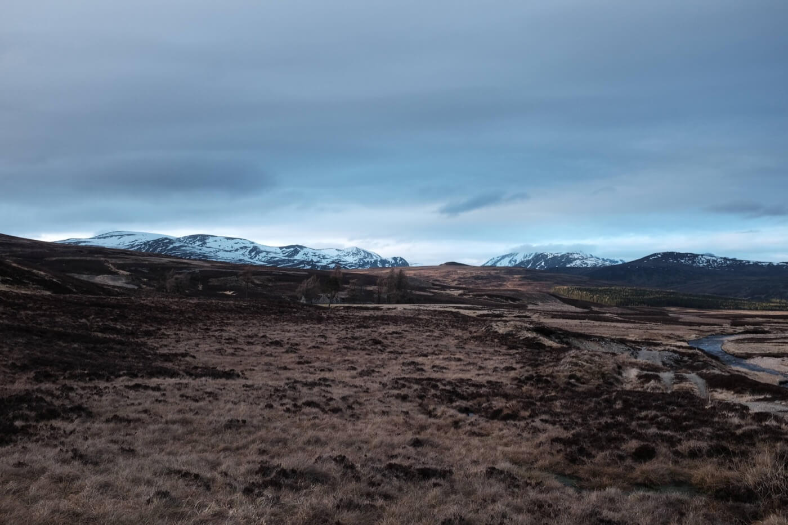

Tél végén (tavasz elején?) összeszedtük a bátorságunkat és nekivágtunk a skót hegyeknek térképpel, sátorral, hálózsákkal.

A Cairngorms az Egyesült Királyság legnagyobb nemzeti parkja, [igazi vadon](https://wilderness-society.org/european-wilderness-society-supports-mapping-project-to-reveal-europes-wilderness/).

A társaság remek volt: birkák, egy szamár, egy fehér nyúl, egy fácán, vadludak.

Első éjszaka olyan szél volt, hogy a zajtól alig tudtunk aludni, második éjjel szinte fagyott, de a pehely hálózsákok és a forró kávék, levesek melegen tartottak minket.

