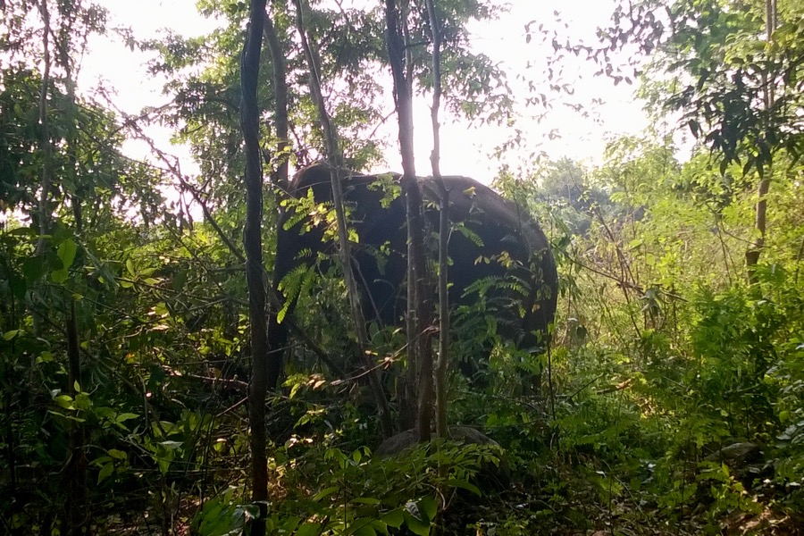
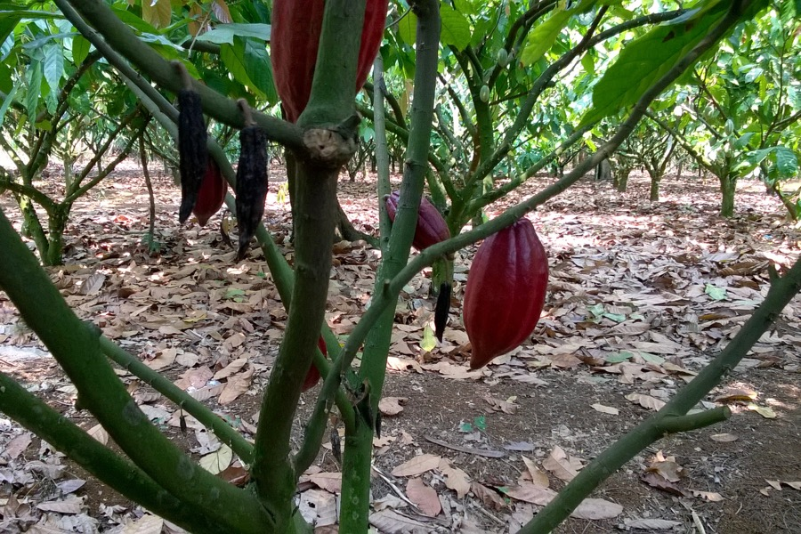
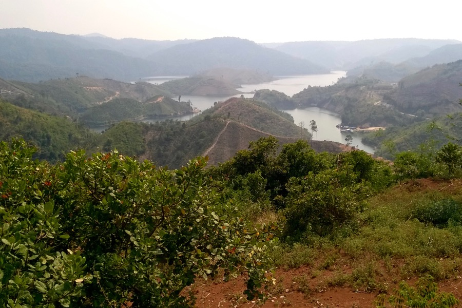
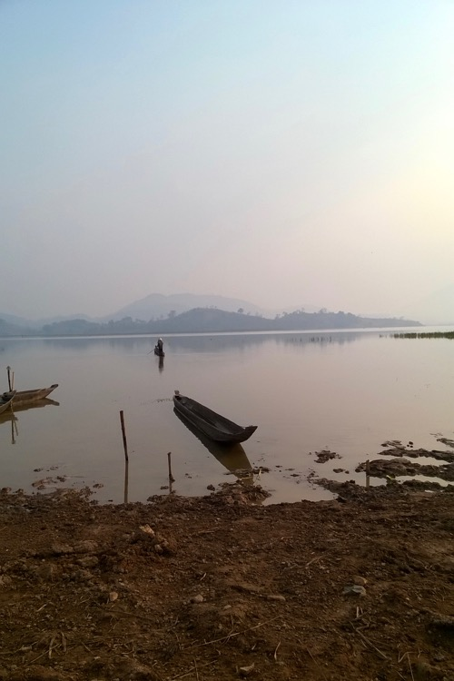
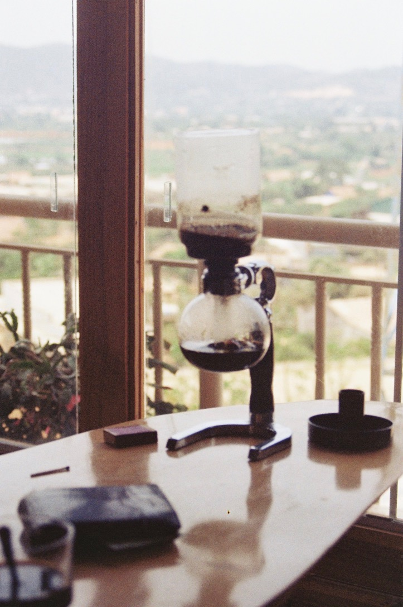

<video src="/video/vn_mot.mp4" poster="/video/vn_mot.png" autoplay loop>
</video>

Rákaptunk a motorozásra. Két keréken, helyi vezetőkkel egy csomó olyan helyre el lehet jutni, ahová nem megy busz.

Út közben láttunk:
- Kávé-, kakaó-, tea-, kaucsukfa- és kesudió-ültetvényt
- Tégla- és evőpálcika-gyárat
- Selyemhernyó-tenyészetet
- Elefántot reggelizni az őserdőben
- Rizspapír- és tésztamanufaktúrát (Eszter kötött is tésztát)
- Egy úszó falut
- Sok szép erdőt.

A motorozáson kívül ilyeneket csináltunk:
- Fürödtünk vízesés lábánál
- Ültünk elefánton (Eszter vezetett is)
- Ittunk cibetmacska-ürülék kávét
- Ettünk sült selyemhernyó-lárvát
- Aludtunk hagyományos hosszúházban (a minimalizmus csúcsa).

