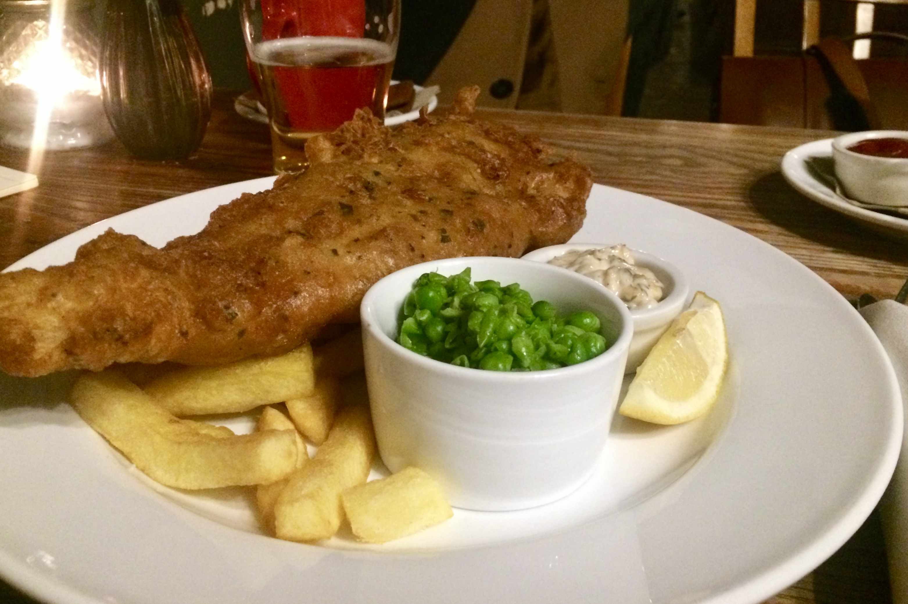

Londonban igenis lehet jót enni.

Többek között ilyeneket ettünk eddig:

- vajban sült, pihepuha rántott csirke juharszirupos goffrival
- _Full English Brexit_ fedőnevű reggeli (hurka, kolbász, bab, bacon, lágytojás)
- omlós portugál grillcsirke
- csípős indiai és thai curry
- leheletvékony tésztájú olasz pizza
- vietnámi levesek, rizstészták
- szusi, és olyan kis japán töltött háromszög rizsszendvics
- csirkés-kolbászos burrito avokádókrémmel és cheddar sajttal
- kiváló fish & chips a helyi pub-ban, a Red Lion-ban  
- sajtok (a Tescoban kapható a kedvenc francia sajtunk, a St Agur! és ma vettünk kb. egy kiló cheddart)
- cuki mini _cupcake_-eket (lásd a fotón)

Ezen kívül Samu látott __rántott kolbászt__. Kolbász, bundában (hogy ne fázzon).

És van egy külön bolt, ha spanyol sonkát akarnánk venni. _Spanyol sonka bolt_.

Majd később írunk sörökről is, de ahhoz még terepgyakorlatot kell végeznünk egy pár helyen.

