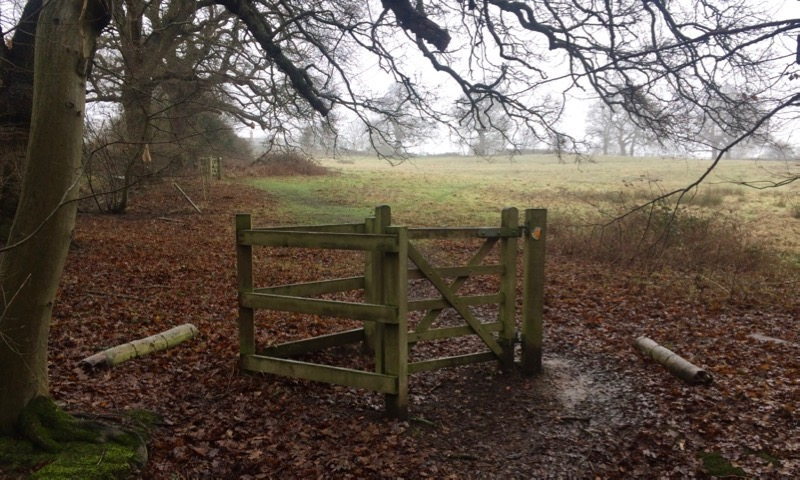

Múlt vasárnap a nem éppen nyárias idő ellenére az Epping erdőbe mentünk kirándulni. Elvileg rengeteg őz lakik ott, de sajnos nem találkoztunk velük. Viszont láttunk nyuszit és mókust, és a hó is esett! 

Átfáztunk, patakon átugráltunk, kempingbe betévedtünk, és sárban tapicskoltunk. Alig várjuk, hogy jobb időben visszamehessünk.

The Bull névre hallgató fogadó Theydon Bois-ban, ahonnan indultunk:  

Ilyen kis csiki-csuki kapukon (vagy mellettük) kellett átmenni:  

És ilyen szép zöld mezőkön cuppogtunk a vizes fűben.  

 
